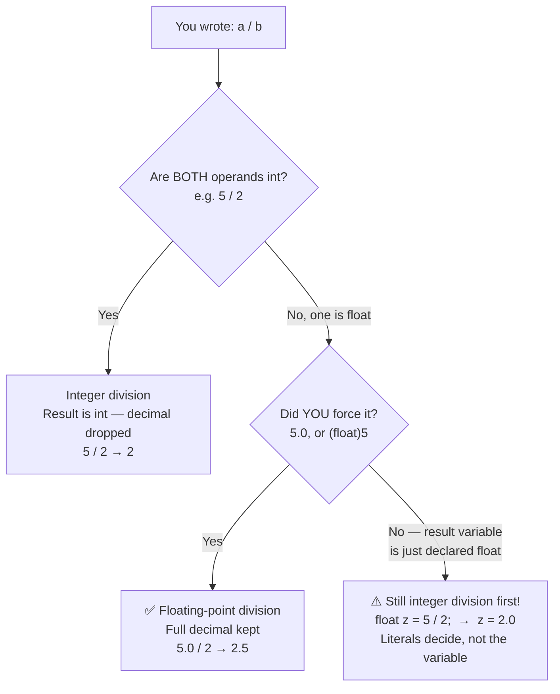

<div align="center">

# 📦 01_Basics
### Variables, Operators & I/O

📍 [C-Programming-Journey](../README.md) **›** **01_Basics** **›** [02_If_Else](../02_If_Else)

[](.) [](.) [](https://en.wikipedia.org/wiki/C_(programming_language))

*Chapter 1 of the [C-Programming-Journey](../README.md). Every `printf` glitch, every `int/int` surprise, every "why is the output like that?!" moment from Lecture 1 lives here.*

</div>

This is where C stopped being syntax on a slide and started being **behavior I had to predict, get wrong, and understand.** 55 files, one course concept at a time — `printf` → variables → arithmetic → the float/int division trap → `scanf` → modulo → typecasting → `char`/ASCII → datatype limits.

> 💡 **How this file is organized:** the Table of Contents, Decision Tree, and Cheat Sheet up top are your fast-reference layer. Every numbered section below is fully expanded — scroll through, or jump straight to one via the TOC.

---

## 🧭 Table of Contents

| # | Section | Files | What breaks your brain first |
|---|---------|:-----:|---|
| 1 | [`printf` & Escape Sequences](#section-1) | 13 | `\n` placement changes everything |
| 2 | [Variables & Integer Arithmetic](#section-2) | 4 | `5 / 2` is `2`, not `2.5` |
| 3 | [Float & the Division Trap](#section-3) | 5 | `float x = 5/2;` is **still** `2.000000` |
| 4 | [Real Formulas in Float](#section-4) | 5 | BODMAS, but for compilers |
| 5 | [Variable Naming Rules](#section-5) | 3 | 32 reserved keywords |
| 6 | [User Input with `scanf`](#section-6) | 7 | `&x` vs `x` — undefined behavior |
| 7 | [The Modulo Operator `%`](#section-7) | 3 | mod by zero ≠ crash (but don't trust it) |
| 8 | [Typecasting & Precedence](#section-8) | 5 | `(float)7/2` vs `7/(float)2` |
| 9 | [`char` & ASCII](#section-9) | 3 | a letter *is* a number |
| 10 | [Datatype Limits & MCQs](#section-10) | 7 | overflow makes `32768` become `-32768` |

---

## 🌲 The Decision Tree Behind Half This Folder

Almost every "predict the output" trap in this chapter traces back to one question: **what type is the division actually happening in?**



> The variable's declared type (`int` / `float`) decides **nothing** about how a division happens. The **type of the operands in the expression** decides everything — the result is computed first, then stored.

---

<a id="section-1"></a>
## 1. 🖨️ `printf` & Escape Sequences
<sub>files `01`–`13`</sub>

<details open>
<summary><b>📂 Files &amp; Concepts</b> <sub>(click to collapse)</sub></summary>
<br>

The course's opening trick: `printf` **never** adds a newline on its own — you have to ask for it with `\n`. Every file here pokes at that idea from a different angle until it's unforgettable.

| File | Concept |
|---|---|
| `01_hello_world.c` | The obligatory first program. `printf` prints exactly what's between the quotes. |
| `02_predict_output.c` | Same idea, different string — "predict before you run" pattern starts here. |
| `03_predict_output.c` | Three `printf`s, zero `\n` → everything glues onto one line. |
| `04_escape_sequence.c` | Introduces `\n` as its own `printf("\n")` call. |
| `05_predict_output.c` | Two `\n`s back to back → one *blank* line, not two. |
| `06_escape_sequence_at_end.c` | Cleaner pattern: put `\n` **inside** the string it follows. |
| `07_escape_sequence_in_middle.c` | `\n` mid-string also prints the space after it — a sneaky gotcha. |
| `08_escape_sequence_at_beginning.c` | `\n` at the *start* of a string pushes a line break before the text. |
| `09_predict_output.c` | Leading `\n` on the very first `printf` → a blank line at the top of the program. |
| `10_escape_sequence_summary.c` | All three placements (start / middle / end) combined in one file. |
| `11_multiple_lines_single_printf.c` | You don't need multiple `printf` calls — `\n` inside *one* string is enough. |
| `12_predict_output.c` | Trap: `\n` (escape) vs the literal text `/n` look similar but behave nothing alike. |
| `13_space_printing.c` | Leading/trailing spaces inside `""` are printed exactly as typed — whitespace is literal. |

> **Takeaway:** `\n` is a *character*, not a formatting button. Where you place it inside the string is where the line breaks.

</details>

---

<a id="section-2"></a>
## 2. 🧮 Variables & Integer Arithmetic
<sub>files `14`–`17`</sub>

<details open>
<summary><b>📂 Files &amp; Concepts</b> <sub>(click to collapse)</sub></summary>
<br>

| File | Concept |
|---|---|
| `14_int_variable.c` | `int x;` declares, `x = 5;` assigns. `printf("x")` ≠ `printf("%d", x)` — quotes print text, `%d` prints the value. |
| `15_updation.c` | Declare + initialize in one line (`int x = 5;`), then update (`x = x + 5;`). |
| `16_int_arithmetic.c` | `+ - *` behave normally. `/` doesn't: `5 / 2` → `2`, because **int ÷ int = int** (quotient only, remainder dropped). |
| `17_details_int_division.c` | Proves it's *not* rounding `2.5 → 2`. The computer never computes `2.5` — integer division is a different operation entirely. |

> **Takeaway:** `int / int` always produces an `int`. The decimal part isn't rounded away — it's never created.

</details>

---

<a id="section-3"></a>
## 3. 🌊 Float & the Division Trap
<sub>files `18`–`22`</sub>

<details open>
<summary><b>📂 Files &amp; Concepts</b> <sub>(click to collapse)</sub></summary>
<br>

The single most important lesson of this chapter, told through five escalating "wait, what?" moments.

| File | Concept |
|---|---|
| `18_float_datatype.c` | `float` stores real numbers. `%f` prints **6 digits after the decimal** by default — always, even for whole numbers (`5` → `5.000000`). |
| `19_float_division.c` | `float / float` works as expected: `5.0 / 2.0 = 2.500000`. |
| `20_predict_output.c` | The trap: `float z = 5 / 2;` is still `2.000000`! The *literals* `5` and `2` are int — the float variable just stores the (already-wrong) int result. |
| `21_float_division_in_depth.c` | **The type of the operands decides the result — not the variable they're stored in.** Two fixes: make one operand `5.0`, or typecast with `(float)5`. |
| `22_float_arithmetic.c` | Mixing `%f` with an `int` expression (`printf("%f", 5/2)`) is undefined behavior — format specifier and argument type must match. |

> **Takeaway (memorize this):**
> ```
> int   / int   = int     ❌ 5/2    → 2
> float / int   = float   ✅ 5.0/2  → 2.5
> int   / float = float   ✅ 5/2.0  → 2.5
> (float)int/int = float  ✅ (float)5/2 → 2.5
> ```

</details>

---

<a id="section-4"></a>
## 4. 🧾 Real Formulas in Float
<sub>files `23`–`26`, `30`</sub>

<details open>
<summary><b>📂 Files &amp; Concepts</b> <sub>(click to collapse)</sub></summary>
<br>

Putting the division rules to work on actual math — proof that one missed `.0` quietly corrupts a real calculation.

| File | Concept |
|---|---|
| `23_volume_of_sphere.c` | `V = (4/3)πr³` — all-float arithmetic, correct from the start. |
| `24_area_of_circle_hw.c` | Homework: `A = πr²`. |
| `25_percentage.c` | Average of 5 subjects — first real use of operator precedence (BODMAS) in a formula. |
| `26_percentage_hw.c` | Homework: percentage out of 160, formatted to 2 decimals with `%.2f`. |
| `30_simple_interest.c` | `SI = (P × R × T)/100` — four variables declared in a single line (`float p, r, t, si;`). |

> **Takeaway:** A formula is only as correct as its weakest operand. One stray `int` literal anywhere in the expression can quietly truncate the whole result.

</details>

---

<a id="section-5"></a>
## 5. 🏷️ Variable Naming Rules
<sub>files `27`–`29`</sub>

<details open>
<summary><b>📂 Files &amp; Concepts</b> <sub>(click to collapse)</sub></summary>
<br>

| File | Concept |
|---|---|
| `27_variable_naming.c` | Why `radius` beats `r` — readable names *are* part of correct code. |
| `28_variable_naming_rules.c` | The 4 hard rules: start with a letter/`_`, no special characters, no reserved keywords, no spaces/commas. Also: **C is case-sensitive** (`a1` ≠ `A1`). |
| `29_variable_naming_exercises.c` | 15 names judged valid/invalid — `basic-hra`, `#MEAN`, `2015_DDay` and friends, each with the rule they break. |

<details open>
<summary>📋 The 32 reserved keywords (click to expand)</summary>

```
auto      double    int       break     extern    enum      unsigned  while
case      sizeof    for       const     static    long      continue  float
else      signed    do        short     switch    char      volatile  default
goto      struct    if        union     return    void      register  typedef
```

</details>

</details>

---

<a id="section-6"></a>
## 6. ⌨️ User Input with `scanf`
<sub>files `31`–`37`</sub>

<details open>
<summary><b>📂 Files &amp; Concepts</b> <sub>(click to collapse)</sub></summary>
<br>

| File | Concept |
|---|---|
| `31_user_input.c` | First `scanf("%d", &x)` — note the `&`, it's not optional. |
| `32_square_of_number.c` | Read a number, square it, print it. |
| `33_area_of_circle_input.c` | Same circle-area formula, now driven by user input instead of a hardcoded radius. |
| `34_simple_interest_input.c` | Three sequential `scanf` calls for `principal`, `rate`, `time`. |
| `35_input_scanf_and_address.c` | **The why behind `&`:** `%d` expects a *value*, `%p` expects an *address*. `scanf` always needs the address (`&x`) — skip it and risk a segfault. |
| `36_sum_of_2_numbers_hw.c` | Homework: two inputs, one sum. |
| `37_predict_output.c` | One `scanf("%d %d", &p, &q)` reads two values — separated by a space *or* Enter, both work. |

> **Takeaway:** `printf` reads a *value* (`x`). `scanf` needs a *location to write into* — that's what `&x` (the address-of operator) provides.

</details>

---

<a id="section-7"></a>
## 7. ➗ The Modulo Operator `%`
<sub>files `38`–`40`</sub>

<details open>
<summary><b>📂 Files &amp; Concepts</b> <sub>(click to collapse)</sub></summary>
<br>

| File | Concept |
|---|---|
| `38_remainder.c` | Remainder computed manually: `r = a - b * (a / b)`. |
| `39_remainder_using_modulo_operator.c` | The same thing, one operator: `r = a % b`. |
| `40_modulo_special_cases.c` | Three edge cases: normal remainder, `dividend < divisor` (remainder = dividend), and **mod by zero** — undefined behavior; the compiler may print *something*, but never rely on it. |

> **Takeaway:** `Dividend = Divisor × Quotient + Remainder`, rearranged: `r = a - b*(a/b)` — which is exactly what `%` automates.

</details>

---

<a id="section-8"></a>
## 8. 🎯 Typecasting & Operator Precedence
<sub>files `41`–`45`</sub>

<details open>
<summary><b>📂 Files &amp; Concepts</b> <sub>(click to collapse)</sub></summary>
<br>

| File | Concept |
|---|---|
| `41_half_of_integer.c` | `x / 2.0` forces floating-point division without ever declaring a `float` variable. |
| `42_fractional_part_of_float.c` | `(int)x` extracts the integer part (acts like ⌊x⌋ for positives); `x - (int)x` gives the fractional remainder. |
| `43_hierarchy_of_operators.c` | BODMAS holds, **but** `*`, `/`, `%` share precedence and resolve **left-to-right** — so `2*3/4` ≠ `2*(3/4)` on a computer, even though they're equal in math. |
| `44_predict_output.c` | Stress-tests precedence + associativity across mixed `int`/`float` expressions in one line. |
| `45_integer_vs_float_operators.c` | `%` is **int-only** — `float % float` is a compile error. `+ - * /` work on both. |

> **Takeaway:** Same precedence ≠ same grouping. When operators tie, the computer evaluates strictly left-to-right — don't assume it groups the way you would on paper.

</details>

---

<a id="section-9"></a>
## 9. 🔡 `char` & ASCII
<sub>files `46`–`48`</sub>

<details open>
<summary><b>📂 Files &amp; Concepts</b> <sub>(click to collapse)</sub></summary>
<br>

| File | Concept |
|---|---|
| `46_char_basics.c` | `char` stores a single character, printed with `%c`. |
| `47_ascii_values.c` | The same `char` printed with `%d` reveals its **ASCII value** — `'a'` is just `97` in disguise. |
| `48_ascii_table.c` | Generates the full table (letters, digits, symbols) using `for` loops — a sneak peek at Chapter 3, used purely as a printing shortcut here. |

> **Memorize these anchors:**
> | Range | ASCII |
> |---|---|
> | `'A'`–`'Z'` | 65–90 |
> | `'a'`–`'z'` | 97–122 |
> | `'0'`–`'9'` | 48–57 |

</details>

---

<a id="section-10"></a>
## 10. 📐 Datatype Limits & MCQ Vault
<sub>files `49`–`55`</sub>

<details open>
<summary><b>📂 Files &amp; Concepts</b> <sub>(click to collapse)</sub></summary>
<br>

| File | Concept |
|---|---|
| `49_mcqs.c` | 8 conceptual MCQs (character constants, precedence, float printing, overflow, modulo with negatives, type promotion) — answers + reasoning inline. |
| `50_size_of_datatypes.c` | Why `short` overflows at `32768` (wraps to `-32768`) while `int` doesn't — because `short` is 2 bytes (range ±32767) and `int` is 4 bytes. |
| `51_mcq4_integer_division.c` | Worked proof for MCQ 4 — `5/2 = 2`. |
| `52_mcq5_operator_precedence.c` | Worked proof for MCQ 5 — one integer division (`7/22 = 0`) silently zeroes an entire expression. |
| `53_mcq6_datatype_overflow.c` | Worked proof for MCQ 6 — confirms `int` is wide enough where `short` wasn't. |
| `54_mcq7_modulo_behavior.c` | Worked proof for MCQ 7 — `2 % -8 = 2` (sign of the result follows the **dividend**, not the divisor). |
| `55_mcq8_float_division.c` | Worked proof for MCQ 8 — `2 / 7.0 ≈ 0.285714`, a repeating decimal no MCQ option states exactly. |

<details open>
<summary>📏 Datatype sizes cheat-sheet (click to expand)</summary>

| Type | Size | Range |
|---|---|---|
| `char` | 1 byte (8 bits) | ~256 values |
| `short` | 2 bytes (16 bits) | −32,768 to 32,767 |
| `int` | 4 bytes (32 bits) | −2,147,483,648 to 2,147,483,647 |
| `long long` | 8 bytes (64 bits) | −2⁶³ to 2⁶³−1 |

</details>

</details>

---

## ⚡ Cheat Sheet — Every Trap in One Table

| If you see this... | Remember this |
|---|---|
| Output runs onto one line | You forgot `\n` — `printf` never adds one |
| `5 / 2` prints `2` | `int / int = int`. Always. No rounding, no decimals. |
| `float z = 5/2;` is `2.000000` | The **literals'** type matters, not the variable storing the result |
| `%d` on `&x` looks fine but isn't | Addresses need `%p`, not `%d` — that's undefined behavior |
| `scanf("%d", x)` crashes | You needed `&x` — `scanf` writes to an address, not a value |
| `a % b` with float operands won't compile | `%` is integer-only in C |
| `2*3/4` ≠ `2*(3/4)` | Equal precedence → left-to-right evaluation, not free regrouping |
| `short` overflows before `int` does | `short` = 2 bytes (±32767), `int` = 4 bytes — way more headroom |

---

## ⚙️ Running Any File

```bash
gcc 01_Basics/01_hello_world.c -o output
./output
```

| File pattern | How to approach it |
|---|---|
| `*_predict_output.c` | Read it, **guess the output on paper first**, then compile to check |
| `*_hw.c` | Self-practice problem — solved independently of the lecture |
| `*_mcq*.c` | Worked proof for a specific multiple-choice question in `49_mcqs.c` |

---

## 🐛 Bugs That Taught Me More Than the Lecture

> The mistakes the compiler let me make silently — no error, no warning, just a wrong number staring back.

- Printing `5 / 2` with `%f` instead of `%d` doesn't error — it just silently produces garbage. The compiler never checks that a format specifier matches the real argument type.
- Forgetting `&` in `scanf("%d", x)` doesn't always error at compile time either — it's undefined behavior, and it can crash the program outright at runtime.
- A `short` silently overflowing gives a completely wrong number with zero warning. Datatype range limits are a real, practical thing to plan for — not just a textbook footnote.
- `float z = 5 / 2;` *looks* like it should give `2.5` — three different files (`20`, `21`, `44`) exist purely because this one assumption kept resurfacing.

---

<div align="center">

## 🗺️ Where to Next

[](../README.md) &nbsp; [](.) &nbsp; [](../02_If_Else)

<br>

**Your Position in the 12-Chapter Roadmap**

[](./)
[](../02_If_Else)
[](../03_Loops)
[](../04_Pattern_Printing)
[](../05_Functions_Pointers)
[](../06_Recursion)
[](../07_Arrays)
[](../08_2D_Arrays)
[](../09_Strings)
[](../10_Structures)
[](../11_Sorting)
[](../12_Miscellaneous)

`▰▱▱▱▱▱▱▱▱▱▱▱` **1 / 12 chapters traveled**

*One `printf`, one segfault, one "ohhh that's why" at a time.*

</div>
