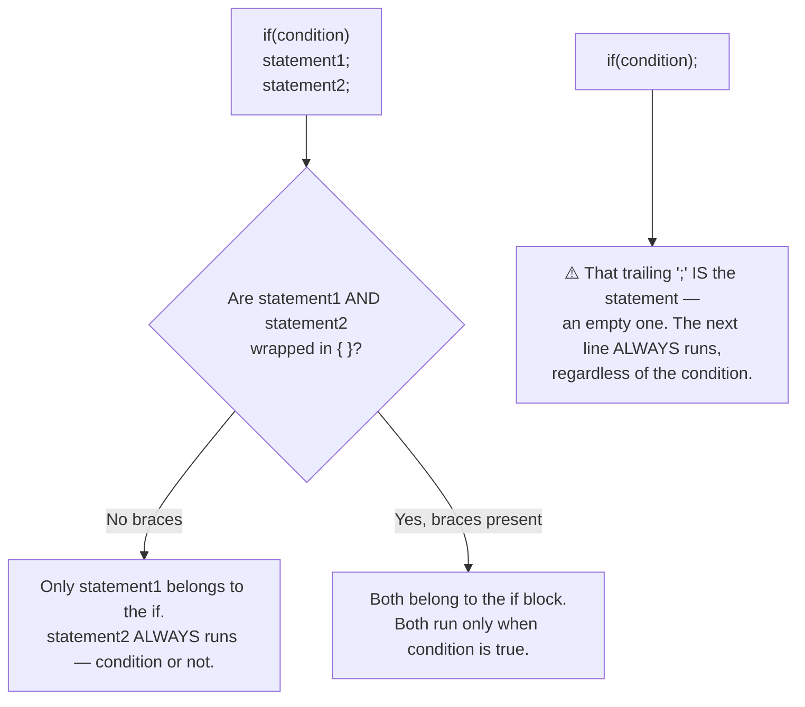

<div align="center">

# 📦 02_If_Else
### Conditional Logic & Branching

📍 [C-Programming-Journey](../README.md) **›** [01_Basics](../01_Basics) **›** **02_If_Else** **›** [03_Loops](../03_Loops)

[](.) [](.) [](https://en.wikipedia.org/wiki/C_(programming_language))

*Chapter 2 of the [C-Programming-Journey](../README.md). Where the program finally gets to make a decision — and where a single missing curly brace teaches you more about C than three lectures combined.*

</div>

`01_Basics` was about getting values right. This chapter is about **branching** — making the program choose a path. 42 files: `if` → `if-else` → logical operators (`&&` `||`) → nested conditions → the `else-if` ladder → the ternary operator → and finally, an entire vault of "predict the output" traps built around two things compilers never warn you about: **stray semicolons** and **missing braces**.

> 💡 **How this file is organized:** the Table of Contents, Decision Tree, and Cheat Sheet up top are your fast-reference layer. Everything below — including every lookup-table — is fully expanded by default. Every `<details>` block is still click-to-collapse if you want to tidy your view, but nothing is ever hidden from you on first load.

---

## 🧭 Table of Contents

| # | Section | Files | What breaks your brain first |
|---|---------|:-----:|---|
| 1 | [First Conditionals — `if` / `if-else`](#section-1) | 6 | `if` with no `else` simply does nothing on false |
| 2 | [Multi-Branch Without `else-if`](#section-2) | 3 | Three separate `if`s all get *checked*, even after one is true |
| 3 | [Logical Operators `&&` / `\|\|`](#section-3) | 3 | one condition vs two conditions changes everything |
| 4 | [Multi-Variable Comparisons](#section-4) | 4 | "greatest of 3" needs 2 comparisons per variable, not 1 |
| 5 | [Nested `if-else` & Precedence](#section-5) | 5 | `&&` binds tighter than `\|\|` — parentheses aren't optional |
| 6 | [Cleaner Nesting & the `else-if` Ladder](#section-6) | 6 | nested `if-else` and `else-if` ladder are *the same logic*, different shape |
| 7 | [Coordinate Geometry Problems](#section-7) | 2 | comparing `double`s with `==` is riskier than it looks |
| 8 | [The Ternary Operator](#section-8) | 1 | one line replaces a whole `if-else` block |
| 9 | [Predict-the-Output Trap Vault](#section-9) | 11 | a `;` right after `if(condition)` silently empties the block |
| 10 | [The Real Thing — Truthy & Falsy in C](#section-10) | 1 | C doesn't have booleans — it has "zero" and "everything else" |

---

## 🌲 The Decision Tree Behind Half This Folder

Almost every "predict the output" trap in this chapter comes down to one question: **what statement(s) does the `if` actually control?**



> Without `{ }`, an `if` controls **exactly one statement** — the very next line, and nothing after it. A stray `;` right after the condition counts as that one statement, and it does nothing. Both traps look harmless and compile cleanly — the compiler never warns you.

---

<a id="section-1"></a>
## 1. 🌱 First Conditionals — `if` / `if-else`
<sub>files `01`–`06`</sub>

<details open>
<summary><b>📂 Files &amp; Concepts</b> <sub>(click to collapse)</sub></summary>
<br>

The first branch in any of these programs. Notice how each file is one tiny step harder than the last.

| File | Concept |
|---|---|
| `01_even_number.c` | A single `if` — checks `n % 2 == 0`, prints only when true. Odd numbers produce **no output at all**. |
| `02_even_odd_only_if.c` | Two *separate* `if` statements (not `if-else`) — both conditions get checked independently. |
| `03_even_odd_if_else.c` | The cleaner version: one `if-else` instead of two `if`s — only one branch ever runs. |
| `04_divisible_by_5.c` | Same `if-else` pattern, new problem. |
| `05_leap_year_hw.c` | Homework: leap year check using `n % 4 == 0` (simplified — ignores the century-year exception on purpose). |
| `06_absolute_value.c` | An `if` with **no `else`** — only negative numbers get modified (`n = n * -1`); positive numbers fall through untouched. |

> **Takeaway:** `if` alone is a filter, not a fork. `if-else` is a fork — exactly one side runs. Don't reach for `if-else` when a single `if` already says what you mean.

</details>

---

<a id="section-2"></a>
## 2. 🔀 Multi-Branch Without `else-if`
<sub>files `07`–`09`</sub>

<details open>
<summary><b>📂 Files &amp; Concepts</b> <sub>(click to collapse)</sub></summary>
<br>

Before learning `else-if`, the course deliberately writes three-way branches the clumsy way — three independent `if`s — so the upgrade later actually feels like one.

| File | Concept |
|---|---|
| `07_profit_loss.c` | Three separate `if`s (`sp > cp`, `sp < cp`, `sp == cp`) — works, but **all three conditions get evaluated every time**, even after one already matched. |
| `08_area_perimeter.c` | Same three-independent-`if`s pattern, applied to area vs. perimeter. |
| `09_greater_than_5.c` | Back to a clean `if-else` — then ends with a deliberate cliffhanger: *what if checking "between 5 and 10" needs two conditions at once?* |

> **Takeaway:** Three independent `if`s checking mutually exclusive outcomes isn't wrong, just wasteful — and it gets worse the more branches you add. (Section 6 fixes this with `else-if`.)

</details>

---

<a id="section-3"></a>
## 3. 🔗 Logical Operators `&&` / `||`
<sub>files `10`–`12`</sub>

<details open>
<summary><b>📂 Files &amp; Concepts</b> <sub>(click to collapse)</sub></summary>
<br>

| File | Concept |
|---|---|
| `10_three_digit_number.c` | First use of `&&` — `n > 99 && n < 1000`. **Both** sides must be true. |
| `11_divisible_by_5_and_3_hw.c` | Homework: `n % 5 == 0 && n % 3 == 0` — with a side-note that `n % 15 == 0` is equivalent. |
| `12_divisible_by_5_or_3.c` | First use of `||` — `n % 5 == 0 \|\| n % 3 == 0`. Only **one** side needs to be true. |

<details open>
<summary><b>📋 Logical operator quick reference</b> <sub>(click to collapse)</sub></summary>

| Operator | Meaning | True when... |
|---|---|---|
| `&&` (AND) | Both conditions | **All** sides are true |
| `\|\|` (OR) | Either condition | **At least one** side is true |
| `!` (NOT) | Inverts a condition | The condition is false |

</details>

> **Takeaway:** `&&` is strict — every condition must hold. `||` is lenient — one is enough. Mixing them up silently changes which inputs your program accepts.

</details>

---

<a id="section-4"></a>
## 4. ⚖️ Multi-Variable Comparisons
<sub>files `13`–`16`</sub>

<details open>
<summary><b>📂 Files &amp; Concepts</b> <sub>(click to collapse)</sub></summary>
<br>

| File | Concept |
|---|---|
| `13_greatest_of_3.c` | To prove `a` is the greatest of 3, you need **two** comparisons: `a > b && a > c`. One comparison alone can't rule out the third variable. |
| `14_greatest_of_4_hw.c` | Same idea scaled up — now **three** comparisons per variable (`a > b && a > c && a > d`). |
| `15_youngest_hw.c` | Same pattern, inverted direction (`<` instead of `>`) — finds the *minimum* instead of the *maximum*. |
| `16_sides_of_triangle.c` | A real geometry rule as a triple `&&`: a triangle is valid only if the sum of **any** two sides exceeds the third — all three checks must hold simultaneously. |

> **Takeaway:** "Is X the greatest among N values?" always needs **N−1 comparisons** — one against every other value. Skipping one comparison means the result is only "true so far," not actually proven.

</details>

---

<a id="section-5"></a>
## 5. 🪆 Nested `if-else` & Precedence
<sub>files `17`–`21`</sub>

<details open>
<summary><b>📂 Files &amp; Concepts</b> <sub>(click to collapse)</sub></summary>
<br>

| File | Concept |
|---|---|
| `17_divisible_by_5_and_3_nested.c` | The `&&` logic from Section 3, rewritten as an `if` inside an `if` — same result, different shape. |
| `18_divisible_by_5_or_3_not_15_nested.c` | Nested version of a 3-condition rule (`÷5 or ÷3`, but `not ÷15`). |
| `19_divisible_by_5_or_3_not_15.c` | The same rule, flattened into one line: `(n % 5 == 0 \|\| n % 3 == 0) && n % 15 != 0`. The parentheses are **mandatory** — `&&` has higher precedence than `\|\|`, so without them the grouping silently changes. |
| `20_comparison_vs_assignment.c` | `=` assigns, `==` compares. Swapping them is one of C's most infamous typos — `if(a = 5)` *compiles* and is always true. |
| `21_if_else_optional_braces.c` | Braces are optional for a **single** statement, mandatory for **multiple** statements — directly previews the trap in Section 9. |

<details open>
<summary><b>📋 Comparison operators quick reference</b> <sub>(click to collapse)</sub></summary>

| Operator | Meaning |
|---|---|
| `==` | equal to |
| `!=` | not equal to |
| `>` / `<` | greater / less than |
| `>=` / `<=` | greater-or-equal / less-or-equal |

</details>

> **Takeaway:** `&&` > `||` in precedence — always parenthesize mixed conditions to make the grouping explicit, for the compiler *and* for the next person reading it (probably future-you).

</details>

---

<a id="section-6"></a>
## 6. 🧹 Cleaner Nesting & the `else-if` Ladder
<sub>files `22`–`27`</sub>

<details open>
<summary><b>📂 Files &amp; Concepts</b> <sub>(click to collapse)</sub></summary>
<br>

| File | Concept |
|---|---|
| `22_greatest_of_3_nested.c` | The "greatest of 3" problem from Section 4, solved with **one** comparison per level of nesting instead of two `&&`s per branch — each comparison eliminates one candidate. |
| `23_youngest_nested_hw.c` | Same elimination-by-nesting idea, applied to "youngest of 3." |
| `24_profit_loss_else_if.c` | The profit/loss problem from Section 2, now fixed with `else if` — only as many conditions as needed get checked; once one matches, the rest are skipped. |
| `25_grade.c` | The canonical `else-if` ladder: `>80 → A`, `>60 → B`, `>40 → C`, else `F`. |
| `26_grade_without_else_if.c` | The *exact same logic* written as deep nested `if-else` instead — proving an `else-if` ladder is really nested `if-else` with the indentation flattened. |
| `27_grade_hw.c` | Homework: a 7-tier grading ladder (`Excellent` down to `Fail`). |

> **Takeaway:** An `else-if` ladder isn't a new feature — it's nested `if-else` in disguise. Once one branch matches, every condition below it is skipped entirely, which is exactly why it's more efficient than Section 2's independent `if`s.

</details>

---

<a id="section-7"></a>
## 7. 📐 Coordinate Geometry Problems
<sub>files `28`–`29`</sub>

<details open>
<summary><b>📂 Files &amp; Concepts</b> <sub>(click to collapse)</sub></summary>
<br>

| File | Concept |
|---|---|
| `28_straight_line.c` | Three points are collinear if the slope between the 1st-2nd pair equals the slope between the 2nd-3rd pair (`m1 == m2`), using `double` and `%lf`. |
| `29_point_position.c` | An `else-if` ladder classifying a point as the origin, on the y-axis, on the x-axis, or none of those. |

> **Takeaway:** Comparing two `double`s with `==` (like `m1 == m2`) works for clean textbook inputs, but real floating-point arithmetic can introduce tiny rounding errors that make a mathematically-equal pair compare as unequal. Worth knowing before relying on it in anything beyond a classroom problem.

</details>

---

<a id="section-8"></a>
## 8. ❓ The Ternary Operator
<sub>file `30`</sub>

<details open>
<summary><b>📂 Files &amp; Concepts</b> <sub>(click to collapse)</sub></summary>
<br>

| File | Concept |
|---|---|
| `30_ternary_operator.c` | `condition ? expression_if_true : expression_if_false` — the even/odd check from Section 1, rewritten as a single line: `n % 2 == 0 ? printf("Even\n") : printf("Odd\n");` |

> **Takeaway:** The ternary operator is an `if-else` that *returns a value* instead of running a block — perfect for short, single-expression decisions. For anything with multiple statements per branch, a normal `if-else` stays more readable.

</details>

---

<a id="section-9"></a>
## 9. 🪤 Predict-the-Output Trap Vault
<sub>files `31`–`41`</sub>

<details open>
<summary><b>📂 Files &amp; Concepts</b> <sub>(click to collapse)</sub></summary>
<br>

Eleven files, one job each: break an assumption about how `if-else` "obviously" works.

| File | Concept |
|---|---|
| `31_predict_output_1.c` | `if(x == y);` — the `;` is the entire if-body (does nothing). The `printf` below runs unconditionally, every time. |
| `32_predict_output_2.c` | No braces, two statements after `if` — only the first (`b = 300`) belongs to the `if`. The second (`c = 200`) and the `printf` always execute, even when the condition is false (leaving `b` with a garbage/uninitialized value in that case). |
| `33_predict_output_3.c` | `else;` — same trap as file 31, on the `else` side this time. |
| `34_predict_output_4.c` | `int x = 3; float y = 3.0; if(x == y)` → **true**. C promotes `x` to `float` before comparing — mixed-type comparisons are allowed and usually do what you'd hope. |
| `35_predict_output_5.c` | `y = x = 10;` (chained assignment, right-to-left) and `z = x < 10;` — a relational expression's result (`0` or `1`) can be stored directly in a variable. |
| `36_boolean_datatype.c` | `bool` from `<stdbool.h>` is really just `int` underneath (`true` = `1`, `false` = `0`). Confirms relational expressions evaluate to a real, usable number. |
| `37_predict_output_6_hw.c` | Homework version of file 35's chained-assignment trap. |
| `38_predict_output_7.c` | `printf("%d%d%d", k == 35, k = 50, k > 40)` — comparison, assignment, *and* a fresh comparison, all evaluated as `printf` arguments, each leaving behind a `0`/`1`/value to print. |
| `39_predict_output_8_hw.c` | Homework version of file 38's pattern. |
| `40_predict_output_9.c` | `int i = 65; char j = 'A'; if(i == j)` → **true**. A `char` is just a small integer — `'A'` *is* `65`. |
| `41_predict_output_10_hw.c` | Homework version of file 32's missing-braces trap. |

> **Takeaway:** Two silent killers — a stray `;` right after `if(...)` (creates an empty statement) and missing `{ }` around multiple statements (only the first one is actually conditional). Neither is a compile error. Both produce output that looks plausible until you trace it line by line.

</details>

---

<a id="section-10"></a>
## 10. 🎭 The Real Thing — Truthy & Falsy in C
<sub>file `42`</sub>

<details open>
<summary><b>📂 Files &amp; Concepts</b> <sub>(click to collapse)</sub></summary>
<br>

| File | Concept |
|---|---|
| `42_the_real_thing.c` | The chapter's final reveal: `if` doesn't need a "boolean" at all. **Any** expression works — `if(3 + 2 % 5)`, `if(a = 10)`, `if(-5)`, even `if('a')` and `if(ch = '#')` all evaluate to true, because in C, `0` is false and **literally everything else is true.** |

> **Takeaway:** C has no real boolean type at its core — `if(condition)` just checks "is this expression's value zero or not?" That single rule quietly explains every trap in Section 9: assignments, comparisons, and characters all reduce to a number, and `if` only ever asks one question of that number.

</details>

---

## ⚡ Cheat Sheet — Every Trap in One Table

| If you see this... | Remember this |
|---|---|
| `if(condition);` then a line below | The `;` IS the if-body (empty). The next line always runs. |
| `if(condition) stmt1; stmt2;` (no braces) | Only `stmt1` is conditional. `stmt2` always runs. |
| `if(a = 5)` always seems to run | You typed `=` (assign) instead of `==` (compare) — and it compiled fine. |
| `int == float` comparison "just works" | C promotes the `int` to `float` first, then compares. |
| `char == int` comparison "just works" | A `char` *is* a small integer — `'A'` is `65` under the hood. |
| `x == y, x = 5, x > 2` inside one `printf` | All three are valid expressions with values (`0`/`1`/the assigned number) — `printf` just prints whatever each one evaluates to. |
| `(A \|\| B) && C` vs `A \|\| (B && C)` | `&&` binds tighter than `\|\|` — always parenthesize mixed logic. |
| `if(-5)` / `if('a')` / `if(anything nonzero)` runs | C has no real boolean — only "zero" (false) and "everything else" (true). |

---

## ⚙️ Running Any File

```bash
gcc 02_If_Else/01_even_number.c -o output
./output
```

| File pattern | How to approach it |
|---|---|
| `*_predict_output_N.c` | Read it, **guess the output on paper first**, then compile to check |
| `*_hw.c` | Self-practice problem — solved independently of the lecture |
| `*_nested.c` | Same problem as a sibling file, rewritten with nested `if-else` instead of `&&`/`\|\|` |

---

## 🐛 Bugs That Taught Me More Than the Lecture

> The mistakes the compiler let me make silently — no error, no warning, just output that didn't match what the code "obviously" said.

- A trailing `;` right after `if(condition)` doesn't error — it just quietly makes the if-body empty, and the *next* line runs no matter what.
- Skipping `{ }` around multiple statements doesn't error either — only the line directly under the `if` is actually conditional; everything after it runs unconditionally.
- Typing `=` instead of `==` inside a condition is one of the easiest typos in C, and it compiles perfectly — `if(a = 5)` assigns `5` to `a` and is *always* true.
- `char` vs `int` comparisons working correctly (`'A' == 65`) was a genuine "wait, that's allowed?" moment — until file 42 made it click that C just doesn't separate "number" from "truth value" at all.

---

<div align="center">

## 🗺️ Where to Next

[](../01_Basics) &nbsp; [](.) &nbsp; [](../03_Loops)

<br>

**Your Position in the 12-Chapter Roadmap**

[](../01_Basics)
[](.)
[](../03_Loops)
[](../04_Pattern_Printing)
[](../05_Functions_Pointers)
[](../06_Recursion)
[](../07_Arrays)
[](../08_2D_Arrays)
[](../09_Strings)
[](../10_Structures)
[](../11_Sorting)
[](../12_Miscellaneous)

`▰▰▱▱▱▱▱▱▱▱▱▱` **2 / 12 chapters traveled**

*One `if`, one missing brace, one "ohhh that's why" at a time.*

</div>