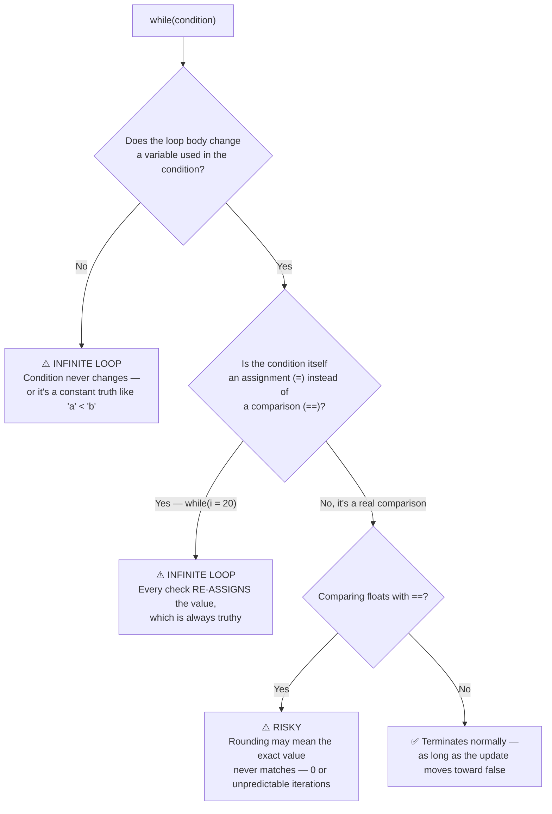

<div align="center">

# 📦 03_Loops
### Repetition, while/for/do-while & the Infinite Loop Trap

📍 [C-Programming-Journey](../README.md) **›** [02_If_Else](../02_If_Else) **›** **03_Loops** **›** [04_Pattern_Printing](../04_Pattern_Printing)

[](.) [](.) [](https://en.wikipedia.org/wiki/C_(programming_language))

*Chapter 3 of the [C-Programming-Journey](../README.md). Where "predict the output" stops being a one-line trick question and starts being "will this program ever stop running?"*

</div>

`02_If_Else` was about choosing a path once. This chapter is about **repeating** one — DRY instead of copy-pasting `printf` a hundred times. 55 files: `for` → printing ranges → AP/GP series → `break`/`continue` → `while` → an entire trap vault built around the scariest question in this folder (*"is this infinite?"*) → `do-while` → digit manipulation → and a closing run of classics (factorial, Fibonacci, power, Armstrong numbers).

> 💡 **How this file is organized:** the Table of Contents, Decision Tree, and Cheat Sheet up top are your fast-reference layer. Everything below — including every lookup-table — is fully expanded by default. Every `<details>` block is still click-to-collapse if you want to tidy your view, but nothing is ever hidden from you on first load.

---

## 🧭 Table of Contents

| # | Section | Files | What breaks your brain first |
|---|---------|:-----:|---|
| 1 | [First Loops — `for` Basics](#section-1) | 6 | the loop variable dies the moment the loop ends |
| 2 | [Printing Ranges & Sequences](#section-2) | 5 | "check every number" vs "generate only the ones you need" |
| 3 | [AP & GP Series](#section-3) | 8 | a formula and a running variable solve the same problem two ways |
| 4 | [`break` & `continue`](#section-4) | 4 | one stops the loop, the other just skips an iteration |
| 5 | [The `while` Loop Fundamentals](#section-5) | 2 | wrong update direction = infinite loop, silently |
| 6 | [Predict-the-Output & Loop Trap Vault](#section-6) | 13 | `while(i = 20)` *looks* like a typo for `==` — and never stops |
| 7 | [Float Precision Deep Dive](#section-7) | 1 | `0.1` isn't really `0.1` to a computer |
| 8 | [The `do-while` Loop](#section-8) | 2 | runs once *even when the condition is false from the start* |
| 9 | [Digit & Number Manipulation](#section-9) | 7 | `n % 10` peels off one digit at a time, every time |
| 10 | [Factorial, Fibonacci, Power & the Capstone](#section-10) | 7 | Armstrong numbers need a loop *inside* a loop |

---

## 🌲 The Decision Tree Behind Half This Folder

Almost every "predict the output" trap in this chapter comes down to one question: **will this condition ever actually become false?**



> A loop isn't "infinite" by accident — it's infinite because *something specific* didn't happen: the condition variable never updates, the condition is secretly an assignment, or the condition compares floats that never land on an exact value. Every trap in Section 6 is one of these three, wearing a different disguise.

---

<a id="section-1"></a>
## 1. 🌱 First Loops — `for` Basics
<sub>files `01`–`06`</sub>

<details open>
<summary><b>📂 Files &amp; Concepts</b> <sub>(click to collapse)</sub></summary>
<br>

| File | Concept |
|---|---|
| `01_what_and_why.c` | The DRY principle (*Don't Repeat Yourself*) — the entire reason loops exist, before a single loop is written. |
| `02_basics_of_loops.c` | The anatomy of `for(init; condition; update)` — each of the three parts named and explained. |
| `03_hello_world_n_times.c` | The loop count comes from `scanf` instead of a hardcoded number — the first *useful* loop. |
| `04_predict_output.c` | The update step doesn't have to be `+1` — `i = i + 2` changes how many times the loop runs entirely. |
| `05_predict_output_hw.c` | Same idea with `i = i + 3` — homework in spotting the new iteration count. |
| `06_scope_of_variables.c` | A `for(int i = ...)` loop variable **dies** the instant the loop ends — `printf("%d", i)` right after won't even compile. Declare it *outside* the loop if you need it later. |

> **Takeaway:** A `for` loop has exactly three jobs — start, keep-going-check, and step — and changing any one of them changes everything about how many times the body runs.

</details>

---

<a id="section-2"></a>
## 2. 🔢 Printing Ranges & Sequences
<sub>files `07`–`11`</sub>

<details open>
<summary><b>📂 Files &amp; Concepts</b> <sub>(click to collapse)</sub></summary>
<br>

| File | Concept |
|---|---|
| `07_print_1_to_100.c` | The simplest possible range loop. |
| `08_print_even_1_to_100.c` | Two strategies side by side: **check every number** (`if(i % 2 == 0)`) vs **only generate the ones you want** (`i = i + 2`). |
| `09_print_odd_1_to_100_hw.c` | Same two strategies, homework, for odd numbers. |
| `10_table_of_19.c` | A multiplication table is just a sequence with a fixed step size. |
| `11_table_of_n_hw.c` | The step size itself becomes a variable (`n`), taken from user input. |

> **Takeaway:** "Check every value and filter" and "generate only the values you need" solve the same problem with very different amounts of wasted work — the second is almost always the smarter loop.

</details>

---

<a id="section-3"></a>
## 3. 📈 AP & GP Series
<sub>files `12`–`19`</sub>

<details open>
<summary><b>📂 Files &amp; Concepts</b> <sub>(click to collapse)</sub></summary>
<br>

| File | Concept |
|---|---|
| `12_ap_1_3_5.c` | Arithmetic Progression via formula: loop the index up to `2n - 1`, derived from `aₙ = a + (n-1)d`. |
| `13_ap_4_7_10_hw.c` | Same formula approach, different AP. |
| `14_ap_4_7_10_without_maths.c` | The same series **without** deriving a bound formula — two ways: a direct expression (`i * 3 + 1`) or a running variable (`a = a + 3` each pass). |
| `15_ap_1_3_5_without_maths.c` | Same two no-formula strategies, for the AP from file 12. |
| `16_gp_1_2_4.c` | Geometric Progression — only the running-variable strategy works cleanly here (`a = a * 2` each pass). |
| `17_gp_3_12_48_hw.c` | Same running-variable GP strategy, different ratio (`a = a * 4`). |
| `18_ap_positive_terms.c` | Three escalating strategies for "print until the value goes negative": guess-and-hardcode the term count, calculate the exact term count via the AP formula, or — the clean fix — just put the real stopping rule directly in the loop's condition (`a > 0`). |
| `19_gp_100_50_25_hw.c` | A *shrinking* GP (`a = a / 2`) — and it needs `float`, since the terms stop being whole numbers almost immediately. |

> **Takeaway:** When you don't know exactly how many terms you need, don't reverse-engineer a count — put the real stopping condition directly in the loop. File 18 is basically a worked argument for why.

</details>

---

<a id="section-4"></a>
## 4. 🚦 `break` & `continue`
<sub>files `20`–`23`</sub>

<details open>
<summary><b>📂 Files &amp; Concepts</b> <sub>(click to collapse)</sub></summary>
<br>

| File | Concept |
|---|---|
| `20_composite_number.c` | `break` exits the loop **immediately** once a factor is found — no point checking further, the answer's already known. |
| `21_prime_or_composite.c` | A flag variable (`a = 0/1`) set right before the `break` is how you "remember" what the loop discovered, *after* the loop has already exited. |
| `22_print_odd_1_to_100_using_continue.c` | `continue` skips **only the current iteration** — the loop itself keeps running. |
| `23_print_even_1_to_100_using_continue_hw.c` | Same `continue` pattern, opposite filter. |

> **Takeaway:** `break` says "stop the whole loop, right now." `continue` says "skip to the next round, don't stop." Confusing the two silently changes whether your loop finishes early or just skips entries.

</details>

---

<a id="section-5"></a>
## 5. 🔁 The `while` Loop Fundamentals
<sub>files `24`–`25`</sub>

<details open>
<summary><b>📂 Files &amp; Concepts</b> <sub>(click to collapse)</sub></summary>
<br>

| File | Concept |
|---|---|
| `24_while_print_1_to_100.c` | `while` has no built-in init/update slots like `for` — you manage the counter yourself, by hand, before and inside the loop. |
| `25_infinite_while_loop.c` | The bug hiding in plain sight: condition is `i < 101`, but the update is `i = i - 1` — moving *away* from the stopping point instead of toward it. Infinite loop, no error, no warning. |

> **Takeaway:** `while` gives you full manual control over the counter — which also means full manual responsibility for making sure the update actually moves toward the condition going false.

</details>

---

<a id="section-6"></a>
## 6. 🪤 Predict-the-Output & Loop Trap Vault
<sub>files `26`–`38`</sub>

<details open>
<summary><b>📂 Files &amp; Concepts</b> <sub>(click to collapse)</sub></summary>
<br>

Thirteen files, one job each: break an assumption about how loops "obviously" behave.

| File | Concept |
|---|---|
| `26_predict_output_1.c` | `int j;` with **no initial value**, then `while(j <= 10)` — `j` holds a garbage value. The output (and even whether the loop runs at all) is genuinely unpredictable. |
| `27_predict_output_2.c` | The classic typo, shown deliberately: `while(i <= 10);` — that trailing `;` makes the loop body empty, and it would spin forever since `i` is never updated inside an empty body. The file shows the *correct* version side by side as a comment. |
| `28_predict_output_3.c` | `while(x == 1)` with `x` immediately set to `0` inside — runs exactly once, because the very first update already breaks the condition. |
| `29_predict_output_4.c` | `y = --x` (change first, *then* use) vs `z = x--` (use first, *then* change) — same-looking operators, opposite order of operations. |
| `30_predict_output_5.c` | `z = x-- - y` — the post-decrement still returns the **old** value of `x` mid-expression, even though `x` itself changes right after. |
| `31_predict_output_6.c` | `while('a' < 'b') printf(...);` with no braces — perfectly legal single-statement loop, and also a genuine infinite loop, since `'a' < 'b'` is a constant truth that never changes. |
| `32_predict_output_7.c` | `while(i = 20)` — `=` instead of `==`. Every single check **re-assigns** `i` to `20`, which is always truthy. Infinite loop, and it compiles without a single warning. |
| `33_predict_output_8.c` | `while(i = 10)` (with `i` never initialized beforehand) — same assignment trap, but now also resetting an uninitialized variable to a fixed value every pass. Still infinite. |
| `34_predict_output_9.c` | `while(x == 1.1)` — float precision strikes again. `1.1` can't be stored exactly, so the comparison can fail in ways that produce **no output at all**. |
| `35_predict_output_10.c` | `while('1' < '2')` — `'1'` and `'2'` are ASCII codes (`49 < 50`), a constant truth. Infinite loop, same shape as file 31. |
| `36_predict_output_11.c` | `continue` inside a `while`, paired with `x--`/`y++` placed **before** the `if` — `continue` skips the `printf`, but the increments above it already happened, so the counters keep moving even on skipped rounds. |
| `37_predict_output_12.c` | No braces after `else`, with multiple lines following — only the `printf` belongs to the `else`. The `x--` and `y++` below it run **unconditionally, every iteration**, regardless of which branch fired. Same brace trap as `02_If_Else`, now inside a loop. |
| `38_increment_decrement.c` | The full reference file — every pre/post increment/decrement combination, worked through explicitly. See the quick-reference table below. |

<details open>
<summary><b>📋 Pre vs Post Increment/Decrement quick reference</b> <sub>(click to collapse)</sub></summary>

| Form | Behavior |
|---|---|
| `x++` | Use the **current** value first, *then* increase by 1 |
| `++x` | Increase by 1 first, *then* use the **new** value |
| `x--` | Use the **current** value first, *then* decrease by 1 |
| `--x` | Decrease by 1 first, *then* use the **new** value |

</details>

> **Takeaway:** Every infinite loop in this vault traces back to one of three things: the condition variable never actually updates, the condition is secretly an assignment (`=` instead of `==`), or the condition compares floating-point numbers for exact equality. Spot which of the three it is, and the "trick" stops being tricky.

</details>

---

<a id="section-7"></a>
## 7. 🌊 Float Precision Deep Dive
<sub>file `39`</sub>

<details open>
<summary><b>📂 Files &amp; Concepts</b> <sub>(click to collapse)</sub></summary>
<br>

| File | Concept |
|---|---|
| `39_float_precision_problem.c` | `printf("%.20f", 0.1f)` reveals the real stored value isn't `0.1` at all — it's `0.10000000149...`. Some float comparisons (`2.0 == 2`) happen to work because that exact value *can* be stored cleanly; others (`0.1 == 0.1`, or `1.01 - 1 == 0.01`) silently fail because the stored approximation doesn't line up. |

> **Takeaway:** `float`/`double` store the *closest representable* value, not the exact one you typed. `==` on floats isn't wrong syntax — it's just gambling on whether two approximations happen to match bit-for-bit.

</details>

---

<a id="section-8"></a>
## 8. 🔂 The `do-while` Loop
<sub>files `40`–`41`</sub>

<details open>
<summary><b>📂 Files &amp; Concepts</b> <sub>(click to collapse)</sub></summary>
<br>

| File | Concept |
|---|---|
| `40_do_while_loop_special_case.c` | The one case that actually proves the difference: a `while` loop with a false-from-the-start condition runs **zero** times, but the equivalent `do-while` still runs **once**, because it checks the condition *after* the body. |
| `41_do_while_loop_general_case.c` | The same `while` vs `do-while` pair, but with a condition that's true from the start — here, both loops behave identically, which is exactly why file 40's special case is the one that actually teaches something. |

> **Takeaway:** `while` checks first, then maybe runs. `do-while` runs first, then maybe checks again. They only visibly differ when the condition is false on the very first check — that's the entire reason `do-while` exists.

</details>

---

<a id="section-9"></a>
## 9. 🔢 Digit & Number Manipulation
<sub>files `42`–`48`</sub>

<details open>
<summary><b>📂 Files &amp; Concepts</b> <sub>(click to collapse)</sub></summary>
<br>

| File | Concept |
|---|---|
| `42_count_digits.c` | `n % 10` peels off the last digit, `n / 10` drops it — repeat until `n` hits `0`. Includes the `n == 0` edge case, which would otherwise count as zero digits. |
| `43_sum_of_digits.c` | Same peel-and-drop loop, accumulating a sum instead of a count. |
| `44_sum_of_even_digits_hw.c` | Same loop, with an `if` filtering which peeled digits count. |
| `45_sum_of_odd_digits_hw.c` | Same loop, opposite filter. |
| `46_reverse_number.c` | Building the reverse digit-by-digit: `r = r * 10 + last_digit` — shown two ways, including a callout that doing the multiply *after* adding the digit (wrong order) breaks the result. |
| `47_number_and_reverse_sum_hw.c` | Reuses the exact reverse-building loop from file 46, then adds the original number back in. |
| `48_alternating_series_sum.c` | `1 - 2 + 3 - 4...` solved two ways: a loop that flips sign based on `i % 2`, and a closed-form formula that skips the loop entirely. |

> **Takeaway:** `% 10` and `/ 10` together are the entire toolkit for digit-by-digit number manipulation in C — every problem in this section is the same two operations, aimed at a different goal.

</details>

---

<a id="section-10"></a>
## 10. 🏁 Factorial, Fibonacci, Power & the Capstone
<sub>files `49`–`55`</sub>

<details open>
<summary><b>📂 Files &amp; Concepts</b> <sub>(click to collapse)</sub></summary>
<br>

| File | Concept |
|---|---|
| `49_factorial.c` | A running product (`fact = fact * i`) starting from `1` — the loop *is* the factorial definition. |
| `50_first_n_factorials.c` | Move the `printf` **inside** the loop instead of after it — prints every intermediate factorial, not just the final one. |
| `51_nth_fibonacci_number.c` | Two "current" variables (`a`, `b`) that keep sliding forward each iteration — only the *n*th value is kept. |
| `52_first_n_fibonacci_numbers_hw.c` | Same sliding-window logic as file 51, but printing every value along the way instead of discarding them. |
| `53_power_of_number.c` | `power = power * a`, repeated `b` times — exponentiation is just repeated multiplication in a loop. |
| `54_ascii_values.c` | A `char` works directly as a loop counter — `while(ch <= 'Z') { ...; ch++; }` walks the alphabet one letter at a time. |
| `55_armstrong_number_hw.c` | The capstone: a `for` loop (1 to 500) with a `while` loop *inside* it — the outer loop picks each candidate number, the inner loop peels its digits to test the Armstrong condition. |

> **Takeaway:** A "running variable that updates every pass" is the same pattern behind factorial, Fibonacci, and power — only what the update *does* changes. File 55 shows that pattern can nest inside itself: a loop checking many numbers, each one independently solved by another loop.

</details>

---

## ⚡ Cheat Sheet — Every Trap in One Table

| If you see this... | Remember this |
|---|---|
| Loop variable "disappears" right after the loop | `for(int i = ...)` scopes `i` to the loop itself — declare it outside if you need it after |
| Loop never stops | The condition variable isn't being updated inside the body — or the update moves the *wrong* direction |
| `while(i = 20)` never stops | That's `=` (assignment, always truthy), not `==` (comparison) |
| `while(condition);` then a code block below | The `;` is the entire loop body (empty) — if nothing updates the condition, this spins forever |
| `while(x == 1.1)` produces no output | Floats are rarely stored as the *exact* value you typed — `==` on floats is a gamble |
| `while('a' < 'b')` / `while('1' < '2')` never stops | Constant character comparisons are always true — there's nothing to ever make them false |
| `x--` vs `--x` give different results in the same expression | Post (`x--`) uses the old value first; Pre (`--x`) updates first, then uses the new value |
| `while` runs 0 times but `do-while` runs once | `do-while` checks its condition *after* running the body — that's the entire difference |

---

## ⚙️ Running Any File

```bash
gcc 03_Loops/01_what_and_why.c -o output
./output
```

| File pattern | How to approach it |
|---|---|
| `*_predict_output_N.c` | Read it, **guess the output on paper first**, then compile to check |
| `*_hw.c` | Self-practice problem — solved independently of the lecture |
| `*_without_maths.c` | Same series as a sibling file, solved without deriving a bound formula |

---

## 🐛 Bugs That Taught Me More Than the Lecture

> The mistakes the compiler let me make silently — no error, no warning, just a program that either never stopped or never ran.

- `while(i = 20)` doesn't error — it compiles cleanly and just never stops, because every single condition check quietly resets `i` back to `20`.
- An uninitialized loop counter (`int j;` with no value) doesn't error either — the loop's behavior depends on whatever garbage happened to be sitting in memory.
- A `for` loop's own counter variable is genuinely gone the moment the loop ends — trying to print it afterward isn't just "wrong," it's a compile error, which was a good reminder that scope is enforced, not just a style suggestion.
- `while(x == 1.1)` producing *zero* output the first time was more surprising than any error message could have been — the float comparison wasn't "slightly off," it just silently didn't match at all.

---

<div align="center">

## 🗺️ Where to Next

[](../02_If_Else) &nbsp; [](.) &nbsp; [](../04_Pattern_Printing)

<br>

**Your Position in the 12-Chapter Roadmap**

[](../01_Basics)
[](../02_If_Else)
[](.)
[](../04_Pattern_Printing)
[](../05_Functions_Pointers)
[](../06_Recursion)
[](../07_Arrays)
[](../08_2D_Arrays)
[](../09_Strings)
[](../10_Structures)
[](../11_Sorting)
[](../12_Miscellaneous)

`▰▰▰▱▱▱▱▱▱▱▱▱` **3 / 12 chapters traveled**

*One `while`, one infinite loop, one "ohhh that's why" at a time.*

</div>