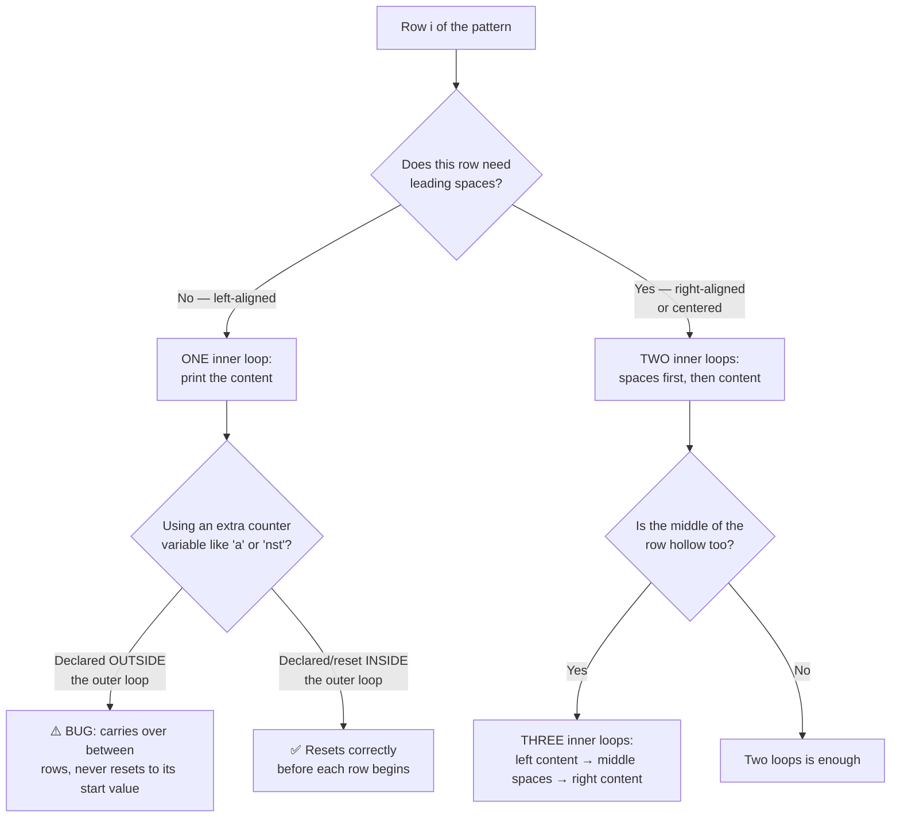

<div align="center">

# 📦 04_Pattern_Printing
### Nested Loops, Visualized

📍 [C-Programming-Journey](../README.md) **›** [03_Loops](../03_Loops) **›** **04_Pattern_Printing** **›** [05_Functions_Pointers](../05_Functions_Pointers)

[](.) [](.) [](https://en.wikipedia.org/wiki/C_(programming_language))

*Chapter 4 of the [C-Programming-Journey](../README.md). Every loop in `03_Loops` was about a number. Every loop here is about a **shape** — and the shape either looks right on screen, or it obviously doesn't.*

</div>

`03_Loops` was about whether a loop stops. This chapter is about **nested loops** — and the single question every pattern boils down to: *for this row, how many things do I actually need to print, and in what order?* 36 files: rectangles → triangles → alphabet/number variants → conditional shapes (plus, cross, hollow) → Floyd's triangle → right-aligned shapes → pyramids → palindromic pyramids → diamonds → and a closing run of hollow/inverted/concentric showpieces.

> 💡 **How this file is organized:** every pattern is shown exactly as it prints — not just described. The Table of Contents, Decision Tree, and Cheat Sheet up top are your fast-reference layer. Everything below is fully expanded by default; every `<details>` block is still click-to-collapse if you want to tidy your view.

---

## 🧭 Table of Contents

| # | Section | Files | What breaks your brain first |
|---|---------|:-----:|---|
| 1 | [Lines, Rectangles & Squares](#section-1) | 6 | one loop for a line, two for a grid |
| 2 | [Left-Aligned Triangles](#section-2) | 5 | growing `j <= i` vs shrinking `j <= n-i+1` |
| 3 | [Alphabet & Mixed Triangles](#section-3) | 3 | `j + 64` turns a number into a letter |
| 4 | [Conditional Shapes — Plus, Cross, Hollow](#section-4) | 3 | the shape is just an `if` hiding inside two loops |
| 5 | [Floyd's Triangle & the 0/1 Triangle](#section-5) | 3 | a counter that never resets vs. one that does |
| 6 | [Right-Aligned Shapes](#section-6) | 3 | every row is spaces **then** content — never one without the other |
| 7 | [Pyramids — Star, Number, Alphabet](#section-7) | 3 | symmetric pyramids need spaces *and* content to move in opposite directions |
| 8 | [Palindromic Pyramids](#section-8) | 2 | the row climbs to a peak, then mirrors itself back down |
| 9 | [Diamonds & Inverted Shapes](#section-9) | 2 | a diamond is two pyramids glued at the base |
| 10 | [Hollow Inverted Pyramids & Concentric Squares](#section-10) | 6 | hollow means *three* zones per row, not two |

---

## 🌲 The Decision Tree Behind Every Pattern

Almost every pattern in this folder is answered by asking the same two questions, in order.



> Almost every "why did my pattern come out wrong" moment in this folder is one of two things: forgetting that a row needs spaces *before* its content (not just content), or forgetting that a per-row counter needs to be declared — or reset — **inside** the outer loop, not before it.

---

<a id="section-1"></a>
## 1. ▭ Lines, Rectangles & Squares
<sub>files `01`–`05`, `10`</sub>

<details open>
<summary><b>📂 Patterns &amp; Concepts</b> <sub>(click to collapse)</sub></summary>
<br>

The starting point: one loop for a single dimension, two nested loops the moment both rows *and* columns matter.

**`01_pattern_printing_intro.c`** — no real pattern yet, just the idea: hardcoded `printf` calls work for a fixed shape, but the moment rows/columns become variables, you need nested loops.
```
* * * * *
* * * * *
* * * * *
```

**`02_horizontal_vertical_stars.c`** — one loop is enough when only *one* dimension changes.
```
* * * * *

*
*
*
*
*
```

**`03_solid_rectangle.c`** — the first real nested loop: outer = rows, inner = columns (independent values `n` and `m`).
```
* * * * *
* * * * *
* * * * *
```

**`04_solid_square_hw.c`** — same as above, but rows and columns share one variable (`n`), since a square's sides are equal.
```
* * * * 
* * * * 
* * * * 
* * * * 
```

**`05_number_square.c`** — swap `printf("* ")` for `printf("%d ", j)` — the *loop structure* doesn't care what you print.
```
1 2 3 4
1 2 3 4
1 2 3 4 
1 2 3 4
```

**`10_odd_number_square.c`** — same square shape, but each row is the odd-number sequence (`1 3 5 7`). Shown four different ways, including a deliberate **bug demonstration**: declaring the running variable `x` *outside* the outer loop means it never resets, and the square comes out wrong.
```
1 3 5 7
1 3 5 7
1 3 5 7
1 3 5 7 
```

> **Takeaway:** A grid pattern is two independent loops, full stop. Whatever you print inside them — stars, numbers, an odd-number sequence — is a separate decision from the loop *shape* itself.

</details>

---

<a id="section-2"></a>
## 2. 📐 Left-Aligned Triangles
<sub>files `06`–`09`, `11`</sub>

<details open>
<summary><b>📂 Patterns &amp; Concepts</b> <sub>(click to collapse)</sub></summary>
<br>

The inner loop's bound stops being a fixed number and starts depending on the outer loop's row index — that single change is what turns a rectangle into a triangle.

**`06_star_triangle.c`** — inner loop runs `j <= i`: row 1 prints 1 star, row 2 prints 2, and so on.
```
*
* *
* * *
* * * * 
```

**`07_star_triangle_inverted.c`** — flip it: each row prints *fewer* stars than the last. Shown two ways — counting down directly (`n - i + 1`), or counting down a separate variable that decrements each row.
```
* * * * 
* * * 
* * 
* 
```

**`08_number_triangle.c`** — same growing-`j` triangle as file 06, printing `j` itself instead of a star.
```
1
1 2
1 2 3
1 2 3 4 
```

**`09_number_triangle_inverted_hw.c`** — the inverted version of file 08, same two strategies as file 07.
```
1 2 3 4
1 2 3
1 2
1
```

**`11_odd_number_triangle.c`** — each row is its own odd-number sequence, growing in length. Same "declare the counter inside the outer loop" lesson as file 10 — shown with the bug first, then the fix.
```
1
1 3
1 3 5
1 3 5 7 
```

> **Takeaway:** `j <= i` (growing) and `j <= n - i + 1` (shrinking) are the two triangle shapes everything else in this chapter builds on. Pyramids, diamonds, and palindromic shapes are all combinations of these two ideas, not new ones.

</details>

---

<a id="section-3"></a>
## 3. 🔤 Alphabet & Mixed Triangles
<sub>files `12`–`14`</sub>

<details open>
<summary><b>📂 Patterns &amp; Concepts</b> <sub>(click to collapse)</sub></summary>
<br>

**`12_alphabet_square.c`** — `j + 64` (or `'A' + j - 1`) converts a loop counter straight into a capital letter, since `'A'` is ASCII `65`.
```
A B C D
A B C D
A B C D
A B C D
```

**`13_alphabet_triangle_hw.c`** — the same `j + 64` trick, on the growing-triangle shape from Section 2.
```
A 
A B 
A B C 
A B C D
```

**`14_number_alphabet_triangle_hw.c`** — an `if(i % 2 == 0)` inside the inner loop decides *per row* whether to print numbers or letters — odd rows are numbers, even rows are letters.
```
1 
A B 
1 2 3
A B C D
1 2 3 4 5
```

> **Takeaway:** Once `j + 64` clicks as "turn a small integer into a capital letter," every numeric pattern in this chapter has an alphabet twin — the loop logic never has to change, only what gets printed.

</details>

---

<a id="section-4"></a>
## 4. ➕ Conditional Shapes — Plus, Cross, Hollow
<sub>files `15`–`17`</sub>

<details open>
<summary><b>📂 Patterns &amp; Concepts</b> <sub>(click to collapse)</sub></summary>
<br>

A real shift in technique: instead of controlling *how many* times the inner loop runs, run it over the full grid every time and use an `if` to decide what each cell prints.

**`15_star_plus.c`** — a full `n × n` grid; a cell prints `*` only if it's on the middle row OR middle column (`i == mid || j == mid`). Swapping that `||` for `&&` produces a completely different shape (a single center dot) from almost the same code.
```
    *
    *
* * * * *
    * 
    * 
```

**`16_hollow_rectangle_hw.c`** — a cell prints `*` only if it's on the border (`i==1 || j==1 || i==n || j==m`); everything else prints blank space.
```
* * * * * *
*         *
*         *
* * * * * * 
```

**`17_star_cross.c`** — a cell prints `*` if it's on either diagonal (`i == j || i + j == n + 1`) — an X shape from one condition.
```
*       * 
  *   *
    *
  *   *
*       *
```

> **Takeaway:** Not every shape needs the inner loop's *bounds* to change. Sometimes the cleanest approach is "check every cell in a full grid, decide what it prints" — a pattern is just an `if` condition describing which coordinates light up.

</details>

---

<a id="section-5"></a>
## 5. 🔢 Floyd's Triangle & the 0/1 Triangle
<sub>files `18`–`20`</sub>

<details open>
<summary><b>📂 Patterns &amp; Concepts</b> <sub>(click to collapse)</sub></summary>
<br>

**`18_floyds_triangle.c`** — a single counter `a` that **keeps climbing across the entire pattern**, never resetting per row — the opposite habit from files 10/11's per-row reset, and just as deliberate.
```
1
2 3
4 5 6 
7 8 9 10
```

**`19_floyds_odd_triangle_hw.c`** — same never-resets counter, stepping by `2` instead of `1`.
```
1 
3 5 
7 9 11 
13 15 17 19 
```

**`20_zero_one_triangle.c`** — alternating `0`/`1` values that flip after every print. The row's *starting* value depends on whether the row number is odd or even — shown both with a flag variable and with a parity formula (`(i + j) % 2`).
```
1
0 1
1 0 1
0 1 0 1
```

> **Takeaway:** Floyd's Triangle is the proof that "should this counter reset every row?" has two valid answers depending on the pattern — files 10/11 reset per row on purpose, Floyd's Triangle deliberately doesn't.

</details>

---

<a id="section-6"></a>
## 6. ↗️ Right-Aligned Shapes
<sub>files `21`–`23`</sub>

<details open>
<summary><b>📂 Patterns &amp; Concepts</b> <sub>(click to collapse)</sub></summary>
<br>

The first appearance of **two** inner loops per row doing two different jobs — leading spaces, then the actual content.

**`21_right_aligned_star_triangle.c`** — loop 1 prints `n - i` blank pairs, loop 2 prints `i` stars. As the star count grows, the space count shrinks — same row index driving both.
```
      * 
    * * 
  * * * 
* * * * 
```

**`22_rhombus_hw.c`** — same shrinking-space loop as file 21, but the star count stays fixed at `n` every row instead of growing — spaces lean it into a slanted rectangle.
```
      * * * * 
    * * * * 
  * * * * 
* * * * 
```

**`23_right_aligned_alphabet_triangle_hw.c`** — file 21's exact structure, printing letters (`k + 64`) instead of stars.
```
      A
    A B
  A B C 
A B C D
```

> **Takeaway:** Once a pattern needs leading spaces, it needs **two** inner loops, not one — and the relationship between "how many spaces" and "how much content" (usually one shrinks as the other grows) *is* the pattern.

</details>

---

<a id="section-7"></a>
## 7. 🔺 Pyramids — Star, Number, Alphabet
<sub>files `24`–`26`</sub>

<details open>
<summary><b>📂 Patterns &amp; Concepts</b> <sub>(click to collapse)</sub></summary>
<br>

A centered pyramid is Section 6's right-aligned idea, but now the content block grows in **both** directions from the center — which means its width has to be odd (`2i - 1`).

**`24_star_pyramid.c`** — shown three escalating ways: deriving the star count from the row index directly (`2*i - 1`), tracking it with a separate counter that climbs by 2 each row, and finally tracking *both* the star count and space count as two independent counters (the cleanest version, and the one reused in every later pyramid).
```
      *
    * * *
  * * * * * 
* * * * * * * 
```

**`25_number_pyramid_hw.c`** — file 24's two-counter approach, printing the running count (`k`) instead of a star.
```
      1
    1 2 3 
  1 2 3 4 5 
1 2 3 4 5 6 7 
```

**`26_alphabet_pyramid_hw.c`** — same structure again, printing letters (`k + 64`).
```
      A
    A B C
  A B C D E
A B C D E F G
```

> **Takeaway:** A pyramid is a right-aligned triangle whose content width grows by 2 each row instead of 1 — that's the entire difference from Section 6, and it's why `2i - 1` shows up everywhere in this section.

</details>

---

<a id="section-8"></a>
## 8. 🪞 Palindromic Pyramids
<sub>files `27`–`28`</sub>

<details open>
<summary><b>📂 Patterns &amp; Concepts</b> <sub>(click to collapse)</sub></summary>
<br>

**`27_palindromic_number_pyramid.c`** — each row climbs `1, 2, 3...` up to the center, then mirrors back down. Solved three ways: tracking a single value that increments before the center and decrements after it, running two separate loops (an increasing one then a decreasing one), and the teacher's two-loop version with explicit space-counting.
```
      1
    1 2 1
  1 2 3 2 1
1 2 3 4 3 2 1
```

**`28_palindromic_alphabet_pyramid_hw.c`** — the exact same three strategies as file 27, with letters instead of numbers.
```
      A
    A B A
  A B C B A
A B C D C B A
```

> **Takeaway:** "Climb up, then mirror back down" is most naturally two separate inner loops — one ascending, one descending — rather than one loop trying to do both jobs with a direction-switching `if`.

</details>

---

<a id="section-9"></a>
## 9. 💎 Diamonds & Inverted Shapes
<sub>files `29`–`30`</sub>

<details open>
<summary><b>📂 Patterns &amp; Concepts</b> <sub>(click to collapse)</sub></summary>
<br>

**`29_star_diamond.c`** — Section 7's pyramid, then the exact same shape upside down stacked right underneath it. The space/star counters that grew through the top half **reverse direction** the moment the middle row is passed (`if(i < mid)` vs `else`).
```
      *
    * * * 
  * * * * * 
* * * * * * * 
  * * * * * 
    * * * 
      * 
```

**`30_right_aligned_inverted_star_triangle.c`** — Section 6's right-aligned triangle, run in reverse: spaces *grow* each row while stars *shrink*, the opposite pairing from file 21.
```
* * * * * 
  * * * * 
    * * * 
      * * 
        * 
```

> **Takeaway:** A diamond isn't a new shape — it's a pyramid where, halfway through, every counter's `++` becomes a `--` and vice versa. Once you've built one pyramid correctly, a diamond is just "do that, then undo it."

</details>

---

<a id="section-10"></a>
## 10. 🕳️ Hollow Inverted Pyramids & Concentric Squares
<sub>files `31`–`36`</sub>

<details open>
<summary><b>📂 Patterns &amp; Concepts</b> <sub>(click to collapse)</sub></summary>
<br>

The capstone section: every row now needs **three** inner loops — left content, a hollow middle, right content — and the final two files step away from spaces-vs-stars entirely into pure coordinate math.

**`31_hollow_inverted_star_pyramid.c`** — first appearance of the three-zone row: stars, then a *growing* gap of spaces, then stars again. Comment included noting the author's interpretation of `n` (total height) differs slightly from the teacher's version (one fewer hollow row) — a real example of a pattern having more than one "correct" reading.
```
* * * * * * * 
* * *   * * * 
* *       * * 
*           *        
```

**`32_hollow_inverted_number_pyramid.c`** — same three-zone structure, with a single counter `a` that keeps incrementing through *all three* zones (including the empty middle) so the left and right number blocks stay correctly sequenced.
```
1 2 3 4 5 6 7 
1 2 3   5 6 7 
1 2       6 7 
1           7       
```

**`33_hollow_inverted_alphabet_pyramid_hw.c`** — file 32's structure, with letters.
```
A B C D E F G
A B C   E F G 
A B       F G 
A           G      
```

**`34_hollow_inverted_palindromic_number_pyramid_hw.c`** — the three-zone hollow structure combined with Section 8's palindromic climb-and-mirror — the most layered pattern in the chapter.
```
1 2 3 4 3 2 1 
1 2 3   3 2 1 
1 2       2 1 
1           1       
```

**`35_reverse_concentric_square.c`** — a complete change of technique: no spaces at all. Every cell's value is `min(distance from each edge)`, computed directly from its `(i, j)` coordinates — rings radiating outward from the center, each one layer "further" than the last.
```
1 1 1 1 1 1 1
1 2 2 2 2 2 1
1 2 3 3 3 2 1
1 2 3 4 3 2 1
1 2 3 3 3 2 1
1 2 2 2 2 2 1
1 1 1 1 1 1 1    
```

**`36_concentric_square.c`** — file 35's exact distance-from-edge formula, with the value flipped (`n + 1 - min`) so the highest number sits in the center instead of the corners.
```
4 4 4 4 4 4 4
4 3 3 3 3 3 4
4 3 2 2 2 3 4
4 3 2 1 2 3 4
4 3 2 2 2 3 4
4 3 3 3 3 3 4
4 4 4 4 4 4 4  
```

> **Takeaway:** Hollow shapes need a third loop because there are three distinct zones in a row, not two. And concentric squares are a reminder that loops with spaces/stars are a *technique*, not the only one — sometimes the cleanest answer is a direct formula on `(row, column)` coordinates, no spaces involved at all.

</details>

---

## ⚡ Cheat Sheet — Every Pattern, One Question Each

| If the row needs... | Use this structure |
|---|---|
| Just content, growing with the row | One inner loop, bound `j <= i` |
| Just content, shrinking with the row | One inner loop, bound `j <= n - i + 1` |
| Leading spaces *and* content | Two inner loops — spaces first, content second |
| Content that grows by 2 each row (a pyramid) | Two inner loops, content bound `k <= 2 * i - 1` |
| A shape decided by coordinates, not bounds | One full `n × n` grid loop + an `if` per cell |
| A counter that should reset every row | Declare (or reset) it **inside** the outer loop |
| A counter that should keep climbing (Floyd's-style) | Declare it **outside** the outer loop, on purpose |
| A hollow middle | Three inner loops — left content, middle spaces, right content |
| A mirrored/palindromic row | Two inner loops — one ascending, one descending |
| A diamond (pyramid + its reflection) | One pyramid loop, with an `if(row < middle)` flipping `++` to `--` halfway through |

---

## ⚙️ Running Any File

```bash
gcc 04_Pattern_Printing/03_solid_rectangle.c -o output
./output
```

| File pattern | How to approach it |
|---|---|
| `*_hw.c` | Self-practice problem — solved independently of the lecture |
| Files with "Way 01 / Way 02 / Way 03" comments | Multiple working strategies for the *same* pattern — compare them, don't just pick one |
| Files with "Approach 01 (My approach) / Approach 02 (Teacher's approach)" | A personal solution attempted before seeing the taught method |

---

## 🐛 Bugs That Taught Me More Than the Lecture

> The mistakes the compiler let me make silently — no error, no warning, just a shape that came out subtly wrong.

- Declaring a per-row counter (like `x` in file 10) **outside** the outer loop doesn't error — it just silently keeps climbing across the whole pattern instead of resetting, and every row after the first comes out wrong.
- Hollow shapes look like a "spaces vs stars" problem until the middle column shows up — then they're actually a "three zones per row" problem, and treating them as two zones quietly breaks the center.
- Swapping `&&` for `||` in a coordinate condition (file 15) doesn't error — it just produces an entirely different, equally valid-looking shape, which was a good reminder that a pattern's *logic* lives entirely in that one condition.
- File 31's own comment about disagreeing with the teacher's interpretation of `n` was the most useful "bug" in the chapter — proof that a pattern can have more than one reasonable reading of its own spec, and the code should say so when it happens.

---

<div align="center">

## 🗺️ Where to Next

[](../03_Loops) &nbsp; [](.) &nbsp; [](../05_Functions_Pointers)

<br>

**Your Position in the 12-Chapter Roadmap**

[](../01_Basics)
[](../02_If_Else)
[](../03_Loops)
[](.)
[](../05_Functions_Pointers)
[](../06_Recursion)
[](../07_Arrays)
[](../08_2D_Arrays)
[](../09_Strings)
[](../10_Structures)
[](../11_Sorting)
[](../12_Miscellaneous)

`▰▰▰▰▱▱▱▱▱▱▱▱` **4 / 12 chapters traveled**

*One nested loop, one off-by-one space, one "ohhh that's why" at a time.*

</div>