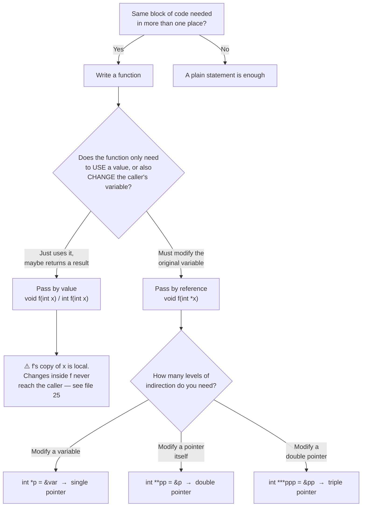

<div align="center">

# 📦 05_Functions_Pointers
### Reusable Logic, and Addresses Instead of Copies

📍 [C-Programming-Journey](../README.md) **›** [04_Pattern_Printing](../04_Pattern_Printing) **›** **05_Functions_Pointers** **›** [06_Recursion](../06_Recursion)

[](.) [](.) [](https://en.wikipedia.org/wiki/C_(programming_language))

*Chapter 5 of the [C-Programming-Journey](../README.md). Chapters 1–4 were about what a single block of code does. This one is about what happens the moment you need that block **more than once, in more than one place** — and what happens when a function needs to reach back and actually change something in the caller.*

</div>

Two ideas run through this whole folder. First: **functions kill repetition** — `greet()` called five times beats five copy-pasted `printf` blocks, and the compiler needs to have already seen a function (definition or prototype) before it's called. Second, and the one that actually breaks people's mental model: **C passes copies, not originals.** `swap(a, b)` cannot swap `a` and `b` in `main()` — it can only shuffle its own local copies. The fix is pointers: pass the *address* instead of the *value*, and suddenly the function can reach back and change the real thing. 38 files: why functions exist → call order & prototypes → parameters & return values → nCr/nPr/Pascal's Triangle → the swap problem → pass by value's limit → pointers → pass by reference → double/triple pointers → practice problems.

> 💡 **How this file is organized:** the Table of Contents, Decision Tree, and Cheat Sheet up top are your fast-reference layer. Every numbered section below is fully expanded — scroll through, or jump straight to one via the TOC.

---

## 🧭 Table of Contents

| # | Section | Files | What breaks your brain first |
|---|---------|:-----:|---|
| 1 | [Why Functions? Solving Repetition](#section-1) | 4 | a function call is just a statement, usable anywhere |
| 2 | [DRY in Practice — A Function Inside a Real Pattern](#section-2) | 1 | reused logic = one place to fix, not five |
| 3 | [Call Flow, Definition Order & Prototypes](#section-3) | 4 | the compiler must *see* a function before it's called |
| 4 | [Parameters & Return Values](#section-4) | 5 | `add(int x, int y)` — the names don't have to match `main()` |
| 5 | [Prototypes Revisited — Local vs Global](#section-5) | 2 | a prototype can live *inside* `main()` too |
| 6 | [nCr, nPr & Pascal's Triangle](#section-6) | 5 | one `factorial()` function, reused three different ways |
| 7 | [The Swap Problem (Setup)](#section-7) | 2 | swapping works fine — *until* it has to happen inside a function |
| 8 | [Pass by Value, Scope & the Swap Failure](#section-8) | 4 | `swap(a, b)` runs, prints correctly... and changes nothing |
| 9 | [Pointers — Storing Addresses](#section-9) | 3 | `x` and `*x` ask two completely different questions |
| 10 | [Pass by Reference & Multi-Level Pointers](#section-10) | 3 | `&a` fixes the swap; `int **` points at a pointer, not a number |
| 11 | [Practice Problems](#section-11) | 5 | putting every idea above into one function each |

---

## 🌲 The Decision Tree Behind Half This Folder

Almost every design choice in this chapter comes down to one question, asked twice.



> **The one rule this whole chapter builds toward:** C is always pass-by-value — a function *always* gets a copy. Pointers don't break that rule; they just make the "value" being copied an *address*, so the copy still points at the same real data.

---

## 🧠 The Core Mental Model — Same Bug, Two Outcomes

`25_pass_by_value_problem.c` and `31_pass_by_reference.c` call an *almost* identical `swap()`, wrapped around the exact same two lines in `main()`. One silently fails. One works. This is the entire chapter in one side-by-side:

<table>
<tr>
<th align="center">❌ Pass by Value — file 25</th>
<th align="center">✅ Pass by Reference — file 31</th>
</tr>
<tr>
<td>

```c
void swap(int a, int b)
{
    int temp = a;
    a = b;
    b = temp;
    // a, b die right here
}

int main()
{
    int a = 2, b = 9;
    swap(a, b);
    // a is STILL 2
    // b is STILL 9
}
```

</td>
<td>

```c
void swap(int *x, int *y)
{
    int temp = *x;
    *x = *y;
    *y = temp;
    // wrote through the addresses
}

int main()
{
    int a = 2, b = 9;
    swap(&a, &b);
    // a is NOW 9
    // b is NOW 2
}
```

</td>
</tr>
<tr>
<td align="center"><code>swap</code> receives the <b>numbers</b> <code>2</code> and <code>9</code> — two brand-new local variables that only happen to start with those values. Swapping them swaps nothing <code>main()</code> can see.</td>
<td align="center"><code>swap</code> receives the <b>addresses</b> of <code>a</code> and <code>b</code>. <code>*x</code> and <code>*y</code> aren't copies — they're doorways straight back into <code>main()</code>'s own memory.</td>
</tr>
</table>

> Nineteen files build up to this exact comparison — 10 (parameters are local) → 25 (that locality breaks a swap) → 26 (because of scope) → 28–30 (here's how to hold an address instead) → 31 (here's the fix). If you only study one pair of files in this whole chapter, make it these two.

---

<a id="section-1"></a>
## 1. 🧩 Why Functions? Solving Repetition
<sub>files `01`–`04`</sub>

<details open>
<summary><b>📂 Files &amp; Concepts</b> <sub>(click to collapse)</sub></summary>
<br>

| File | Concept |
|---|---|
| `01_what_and_why.c` | Sets up the math analogy (`y = f(x)`) then the real reason: loops repeat code *in one place*; functions let you reuse the same block *anywhere* in the program. |
| `02_code_repetition_problem.c` | The problem, made visible: the same three `printf` lines pasted three times — no function yet, just the pain that motivates one. |
| `03_basic_function.c` | The fix: `void greet()` defined once, called three times. First look at a user-defined function alongside `main()`. |
| `04_function_call_in_loop.c` | A function call is just a statement — so it can live inside a `for` loop exactly like `printf` can. |

> **Takeaway:** A function isn't a new language feature bolted on top of C — it's just "a block of statements with a name," and a call to it is a statement like any other, usable anywhere a statement is allowed.

</details>

---

<a id="section-2"></a>
## 2. 🎯 DRY in Practice — A Function Inside a Real Pattern
<sub>file `05`</sub>

<details open>
<summary><b>📂 Files &amp; Concepts</b> <sub>(click to collapse)</sub></summary>
<br>

| File | Concept |
|---|---|
| `05_concentric_square.c` | Chapter 4's concentric-square formula, revisited: the inline `if(a < b) min = a; else min = b;` logic gets pulled out into its own `minimum(a, b)` function, called twice per cell. |

> **Takeaway:** This is the DRY principle (**D**on't **R**epeat **Y**ourself) with real stakes — if the `min` logic ever needs fixing, there's exactly one function to fix, not one copy per place it was used.

</details>

---

<a id="section-3"></a>
## 3. 🔀 Call Flow, Definition Order & Prototypes
<sub>files `06`–`09`</sub>

<details open>
<summary><b>📂 Files &amp; Concepts</b> <sub>(click to collapse)</sub></summary>
<br>

| File | Concept |
|---|---|
| `06_function_call_flow.c` | Traces the exact execution order of nested calls (`main → bangladesh → australia → england`) with numbered comments — control returns back up the same chain it went down. |
| `07_function_definition_order.c` | **Intentional compiler error:** `bangladesh()` calls `australia()` before the compiler has seen it defined — moving the function up the file breaks the build on purpose, to prove the rule. |
| `08_function_prototype.c` | The fix: a **function prototype** (`void greet();`) tells the compiler a function exists before its full definition appears later in the file. |
| `09_function_rules.c` | The formal rules: exactly one `main()`, execution always starts there, and any number of user-defined functions are allowed. |

> **Takeaway:** The compiler reads top to bottom, once. Before it reaches a call to `f()`, it needs to have already seen either `f()`'s full definition or just its prototype — the prototype is a promise the definition will show up eventually.

</details>

---

<a id="section-4"></a>
## 4. 📤 Parameters & Return Values
<sub>files `10`–`14`</sub>

<details open>
<summary><b>📂 Files &amp; Concepts</b> <sub>(click to collapse)</sub></summary>
<br>

| File | Concept |
|---|---|
| `10_sum_of_two.c` | First function with a real return type: `int add(int a, int b)`. Proves `a`/`b` inside `add()` are separate variables from `a`/`b` in `main()`. |
| `11_parameter_names.c` | Same `add()` function, parameters renamed to `x`/`y` — confirms names are just local labels, unrelated to whatever the caller happens to name its own variables. |
| `12_product_of_two.c` | Same shape, different operation — `product(a, b)` returns `a * b`. |
| `13_power_function.c` | A function with a loop inside it: `power(x, y)` computes `x^y` by multiplying in a `for` loop, then returns the result. |
| `14_library_functions.c` | `sqrt()` and `pow()` from `<math.h>` are functions too — just ones someone else already wrote, both returning `double`. |

> **Takeaway:** `void` returns nothing, `int` returns an integer, `char` returns a character — but no matter the return type, a function's parameters are local variables that exist only for the duration of that call.

</details>

---

<a id="section-5"></a>
## 5. 🌐 Prototypes Revisited — Local vs Global
<sub>files `15`–`16`</sub>

<details open>
<summary><b>📂 Files &amp; Concepts</b> <sub>(click to collapse)</sub></summary>
<br>

| File | Concept |
|---|---|
| `15_revisiting_function_prototype.c` | A prototype doesn't have to sit above `main()` — `void fun();` declared *inside* `main()` works too, as long as it appears before the call. |
| `16_global_local_function_prototypes.c` | The `bangladesh → australia → england` chain from file 06, rewritten with a mix of a global prototype (`england`, visible file-wide) and local prototypes (`bangladesh`, `australia`, visible only inside their block) — proving definitions can now appear in *any* order. |

> **Takeaway:** A global prototype (outside every function) is visible to the whole file; a local prototype (inside a block) is visible only inside that block. Either kind satisfies the "compiler must see it before the call" rule.

</details>

---

<a id="section-6"></a>
## 6. 🔢 nCr, nPr & Pascal's Triangle
<sub>files `17`–`21`</sub>

<details open>
<summary><b>📂 Files &amp; Concepts</b> <sub>(click to collapse)</sub></summary>
<br>

One `factorial()` function, reused across five files to build combinations, permutations, and a full triangle out of it.

| File | Concept |
|---|---|
| `17_combination_without_function.c` | nCr computed with three separate hand-written factorial loops (`n!`, `r!`, `(n-r)!`) — verbose, and the same loop logic typed three times. |
| `18_combination_with_function.c` | The fix: one `factorial(n)` function, called three times inside `combination(n, r)`. Same math, a fraction of the code. |
| `19_permutation_hw.c` | Homework: `nPr = n! / (n-r)!`, reusing the exact same `factorial()` function from file 18. |
| `20_pascal_triangle.c` | Pascal's Triangle built by calling `nCr(i, j)` for every cell — each row `i` is literally the row of combinations `iC0, iC1, ..., iCi`. |
| `21_pascal_triangle_optimised.c` | Same triangle, no `factorial()` or `nCr()` at all — each value is derived from the previous one in the row (`next = current × (i-j) / (j+1)`), avoiding repeated large-factorial computation. |

> **Takeaway:** Once `factorial()` exists as a function, nCr, nPr, and Pascal's Triangle stop being three different problems — they're the same building block, assembled three different ways.

</details>

---

<a id="section-7"></a>
## 7. 🔄 The Swap Problem (Setup)
<sub>files `22`–`23`</sub>

<details open>
<summary><b>📂 Files &amp; Concepts</b> <sub>(click to collapse)</sub></summary>
<br>

| File | Concept |
|---|---|
| `22_swap_with_temp.c` | The classic swap, done directly inside `main()` with a `temp` variable — no function involved, and it works fine. |
| `23_swap_without_temp.c` | The same swap using arithmetic (`a = a+b; b = a-b; a = a-b;`) instead of a third variable — also works fine, still inside `main()`. |

> **Takeaway:** Both swaps work perfectly here because they operate directly on `main()`'s own variables. The question the rest of this chapter answers: what happens the moment this logic gets moved *into a separate function*?

</details>

---

<a id="section-8"></a>
## 8. 🚧 Pass by Value, Scope & the Swap Failure
<sub>files `24`–`27`</sub>

<details open>
<summary><b>📂 Files &amp; Concepts</b> <sub>(click to collapse)</sub></summary>
<br>

| File | Concept |
|---|---|
| `24_pass_by_value.c` | Names the pattern already in use since file 10: `combination(n, r)` receives *copies* of `main()`'s `n` and `r` — this is called **pass by value**. |
| `25_pass_by_value_problem.c` | The chapter's central bug: `swap(a, b)` runs, swaps its own local copies perfectly... and `main()`'s `a`/`b` are completely unchanged afterward. |
| `26_scope_of_variables.c` | Why file 25 fails, generalized: a variable declared inside a block (`fun()`, an `if`, a `for`) only exists inside that block — `swap()`'s local `a`/`b` die the moment it returns. |
| `27_formal_and_actual_parameters.c` | Vocabulary for file 25's exact setup: `a`/`b` inside `swap()`'s definition are **formal parameters**; the `a`/`b` passed in from `main()` are **actual parameters** (arguments). |

> **Takeaway:** Pass by value means a function can never reach backward and modify the caller's variables — no matter how correct the swap logic is *inside* the function, it only ever touches disposable local copies.

</details>

---

<a id="section-9"></a>
## 9. 📍 Pointers — Storing Addresses
<sub>files `28`–`30`</sub>

<details open>
<summary><b>📂 Files &amp; Concepts</b> <sub>(click to collapse)</sub></summary>
<br>

| File | Concept |
|---|---|
| `28_pointer_variables.c` | Every variable lives at a memory address (`%p` prints it). A pointer variable (`int *x = &a;`) is just a variable whose *value* is another variable's address. |
| `29_dereferencing_pointers.c` | `x` holds an address; `*x` follows that address and reads the value sitting there — two different questions, two different answers. |
| `30_dereference_operator.c` | `*x` isn't just readable — `*x = 7;` writes through the pointer and changes `a` itself, since `*x` and `a` refer to the exact same memory. |

> **Takeaway:** `x` → *where* is the value. `*x` → *what* is the value at that address. Confusing the two is the single most common pointer mistake — this section exists to make the distinction automatic.

<details open>
<summary>📏 Pointer notation quick-reference (click to expand)</summary>

| Expression | Reads as | Type |
|---|---|---|
| `a` | the value | `int` |
| `&a` | the address of `a` | `int *` |
| `x` (where `int *x = &a`) | the address stored in `x` (same as `&a`) | `int *` |
| `*x` | the value at the address `x` holds (same as `a`) | `int` |
| `&x` | the address of the pointer `x` itself | `int **` |

</details>

</details>

---

<a id="section-10"></a>
## 10. 🔗 Pass by Reference & Multi-Level Pointers
<sub>files `31`–`33`</sub>

<details open>
<summary><b>📂 Files &amp; Concepts</b> <sub>(click to collapse)</sub></summary>
<br>

| File | Concept |
|---|---|
| `31_pass_by_reference.c` | File 25's broken `swap()`, fixed: `swap(int *x, int *y)` takes *addresses* (`swap(&a, &b)`), so `*x = *y` etc. modifies `main()`'s real variables through their addresses. |
| `32_double_pointer.c` | `int *x` stores the address of an `int`. `int **y = &x` stores the address of *that pointer* — `**y` dereferences twice to reach the original `int`. |
| `33_triple_pointer.c` | One level further: `int ***z = &y` stores the address of a double pointer; `***z` dereferences three times to reach the original value. |

> **Takeaway:** Pass by reference isn't a different rule from pass by value — it's the *same* rule (C always copies), applied to an address instead of a plain value. Each extra `*` is just one more hop of "go to the address stored here."

</details>

---

<a id="section-11"></a>
## 11. 🏋️ Practice Problems
<sub>files `34`–`38`</sub>

<details open>
<summary><b>📂 Files &amp; Concepts</b> <sub>(click to collapse)</sub></summary>
<br>

| File | Concept |
|---|---|
| `34_prime_factors_hw.c` | `void prime_factors(int n)` prints every prime factor by repeatedly dividing `n` from `i = 2` upward — a `void` function that does work without returning anything. |
| `35_gcd.c` | Two versions of GCD in one file: a plain forward search (`gcd`) and a slightly more efficient reverse search that `break`s on the first hit (`gcd_rev`) — both built on a shared `min(a, b)` helper. |
| `36_true_false.c` | 10 conceptual true/false statements about scope, `return`, and function rules — answered with reasoning as comments, no runtime logic. |
| `37_factorial_hw.c` | `print_factorials(n)` calls the earlier `factorial(n)` function once per number from `0` to `n` — a function calling another function in a loop. |
| `38_fibonacci_series_hw.c` | `print_fibonacci(n)` prints the first `n` Fibonacci numbers by tracking just two running variables (`a`, `b`) instead of storing the whole sequence. |

> **Takeaway:** Every practice file here reuses a function written earlier in the chapter (`factorial`, `min`) or hands off a clearly scoped sub-task (`prime_factors`, `print_fibonacci`) — proof that once a function exists, later problems get to build on it instead of starting from scratch.

</details>

---

## ⚡ Cheat Sheet — Every Idea in One Table

| If you need to... | Do this |
|---|---|
| Avoid repeating the same block of code | Wrap it in a function, call it wherever needed |
| Call a function before its full definition appears | Add a function prototype (local or global) above the call |
| Return a computed value | Give the function a non-`void` return type + a `return` statement |
| Just perform an action, no value back | Use `void` as the return type |
| Let a function change the caller's own variable | Pass the address (`&var`) and receive it as a pointer parameter |
| Read the value a pointer points to | Dereference it: `*p` |
| Write through a pointer to change the original value | `*p = newValue;` |
| Store the address of a pointer | Use a double pointer: `int **pp = &p;` |
| Store the address of a double pointer | Use a triple pointer: `int ***ppp = &pp;` |

---

## ⚙️ Running Any File

```bash
gcc 05_Functions_Pointers/18_combination_with_function.c -o output
./output
```

| File pattern | How to approach it |
|---|---|
| `*_hw.c` | Self-practice problem — solved independently of the lecture |
| `07_function_definition_order.c` | **Won't compile as-is** — that's the point; it's a deliberate demonstration of the "compiler must see it first" rule |
| Files with "Way 01 / Way 02" comments (e.g. `35_gcd.c`) | Multiple working strategies for the same problem — compare them, don't just pick one |

---

## 🐛 Bugs That Taught Me More Than the Lecture

> The mistakes the compiler let me make silently — no error, no warning, just wrong behavior staring back. (One exception below is a *loud*, intentional error, kept on purpose.)

- `07_function_definition_order.c` is a **deliberate compiler error**, kept in the repo on purpose: moving `bangladesh()` above `australia()`'s definition breaks the build, proving the "must be seen before it's called" rule the hard way instead of just reading about it.
- `25_pass_by_value_problem.c` doesn't error at all — `swap(a, b)` compiles clean, runs clean, and silently does nothing to `main()`'s variables. No warning ever hints that the swap didn't "really" happen.
- Mixing up `x` and `*x` doesn't always error either — printing a pointer with `%d` instead of `%p`, or forgetting the `*` when assigning, tends to compile with a warning at best and produce garbage or a crash at worst.
- `32_double_pointer.c`'s own comment (`int *k = &x;` — commented out) captures a real near-mistake: trying to store the address of a *pointer* inside a single-`*` pointer meant for a plain `int`. The fix needed one more `*`, not a different type.

---

<div align="center">

## 🗺️ Where to Next

[](../04_Pattern_Printing) &nbsp; [](.) &nbsp; [](../06_Recursion)

<br>

**Your Position in the 12-Chapter Roadmap**

[](../01_Basics)
[](../02_If_Else)
[](../03_Loops)
[](../04_Pattern_Printing)
[](.)
[](../06_Recursion)
[](../07_Arrays)
[](../08_2D_Arrays)
[](../09_Strings)
[](../10_Structures)
[](../11_Sorting)
[](../12_Miscellaneous)

`▰▰▰▰▰▱▱▱▱▱▱▱` **5 / 12 chapters traveled**

*One copy, one address, one "ohhh that's why" at a time.*

</div>
