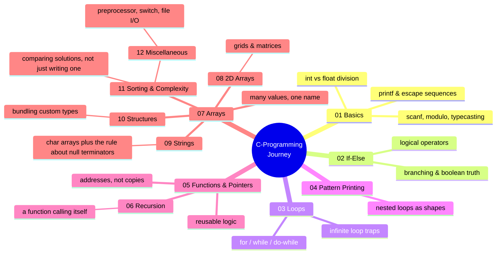
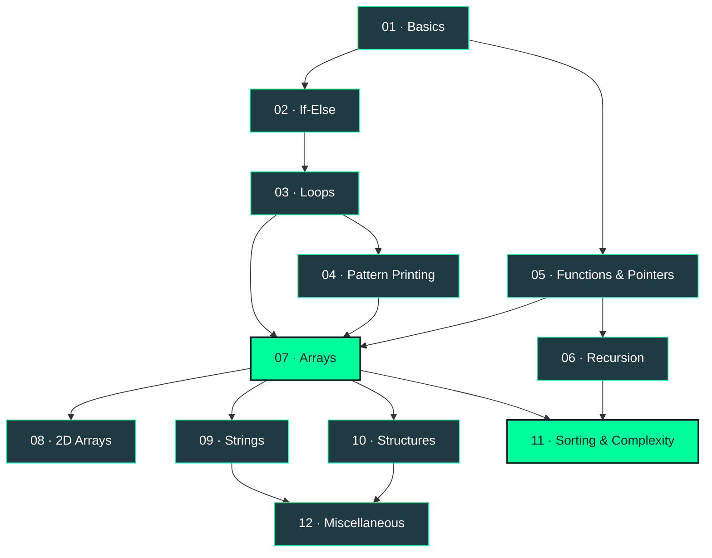

<div align="center">

```
 ██████╗        ██████╗ ██████╗  ██████╗  ██████╗ ██████╗  █████╗ ███╗   ███╗███╗   ███╗██╗███╗   ██╗ ██████╗ 
██╔════╝        ██╔══██╗██╔══██╗██╔═══██╗██╔════╝ ██╔══██╗██╔══██╗████╗ ████║████╗ ████║██║████╗  ██║██╔════╝ 
██║      █████╗ ██████╔╝██████╔╝██║   ██║██║  ███╗██████╔╝███████║██╔████╔██║██╔████╔██║██║██╔██╗ ██║██║  ███╗
██║      ╚════╝ ██╔═══╝ ██╔══██╗██║   ██║██║   ██║██╔══██╗██╔══██║██║╚██╔╝██║██║╚██╔╝██║██║██║╚██╗██║██║   ██║
╚██████╗        ██║     ██║  ██║╚██████╔╝╚██████╔╝██║  ██║██║  ██║██║ ╚═╝ ██║██║ ╚═╝ ██║██║██║ ╚████║╚██████╔╝
 ╚═════╝        ╚═╝     ╚═╝  ╚═╝ ╚═════╝  ╚═════╝ ╚═╝  ╚═╝╚═╝  ╚═╝╚═╝     ╚═╝╚═╝     ╚═╝╚═╝╚═╝  ╚═══╝ ╚═════╝ 
```


<br> 

[](https://en.wikipedia.org/wiki/C_(programming_language))
[-FF6B00?style=for-the-badge&logo=youtube&logoColor=white)](https://www.youtube.com/playlist?list=PLxgZQoSe9cg1drBnejUaDD9GEJBGQ5hMt)
[](./LICENSE)

<!-- These four pull live from GitHub's API every time the page loads — nothing here ever needs manual editing or re-committing. -->
[](../../commits/main)
[](../../stargazers)

[](https://github.com/AlternateArnob/C-Programming-Journey)

</div>

## 👋 What Is This, Really?

This is not a tutorial. It's a **field journal** — the kind you keep while learning something the slow, honest way: practice code, "predict the output" traps I got wrong on purpose, homework solved without peeking, and bugs that compiled cleanly and broke my brain anyway.

📺 I'm following the **[C Programming Course by College Wallah (PW Skills)](https://www.youtube.com/playlist?list=PLxgZQoSe9cg1drBnejUaDD9GEJBGQ5hMt)** on YouTube, lecture by lecture, and this repo mirrors it folder for folder.

> *Why make it public?* So future-me — and anyone learning alongside me — can see exactly how this skill got built. Not the polished, retroactively-cleaned-up version. The real one, mistakes included.

<table align="center">
<tr>
<td>

```c
/* the entire philosophy of this repo, */
/* compiled and run without warnings:  */

#include <stdio.h>

int main(void) {
    int  understanding = 0;
    char attempt        = 'A';

    while (understanding == 0) {
        try(attempt++);     // fail loudly
        learn_why();        // the actual lesson
    }

    printf("ohhh, THAT'S why.\n");
    return 0;
}
```

</td>
</tr>
</table>

## 🧭 How To Use This Repo

| If you're... | Go here |
|---|---|
| 🌱 New to C, following along from zero | Start at [`01_Basics`](./01_Basics) and move through the roadmap in order |
| 🔍 Hunting a specific concept (recursion, pointers, sorting...) | Jump straight there via [Quick Links](#-quick-links) at the bottom |
| 🪤 Chasing a recurring C "gotcha" | See [Universal Gotchas](#-universal-gotchas) below, or any chapter's own Decision Tree |
| 👀 Just browsing the code | Every `.c` file is self-contained — `gcc` it and run it, no setup required |

## 🌳 The Skill Tree

Not a syllabus — a dependency graph. Every branch only exists because something below it had to be understood first.



## 🗺️ The Concept Dependency Map

The skill tree above is the poetry. This is the wiring diagram — an arrow means *"you'll lean on this chapter to survive that one."*



> 🟢 marks the two **hinge chapters** the rest of the course leans on hardest. Loops, Pattern Printing, and Functions all feed into **Arrays (07)**, which then feeds four later chapters. **Sorting (11)** is the other hinge — where Recursion (06) and Arrays (07) finally meet.

## 🎮 The Journey, As A Game Map

If chapters were levels, this is the world map — same 12 stops, played for laughs.

```mermaid
flowchart LR
    L1(("🟢 LV.1<br/>Basics")) --> L2(("🟢 LV.2<br/>If-Else"))
    L2 --> L3(("🟢 LV.3<br/>Loops"))
    L3 --> L4(("🟢 LV.4<br/>Pattern<br/>Printing"))
    L4 --> L5(("🔓 LV.5<br/>Functions<br/>& Pointers<br/>▶ up next"))
    L5 --> L6(("⬛ LV.6<br/>Recursion"))
    L6 --> L7(("⬛ LV.7<br/>Arrays<br/>👑 BOSS"))
    L7 --> L8(("⬛ LV.8<br/>2D Arrays"))
    L8 --> L9(("⬛ LV.9<br/>Strings"))
    L9 --> L10(("⬛ LV.10<br/>Structures"))
    L10 --> L11(("⬛ LV.11<br/>Sorting<br/>👑 FINAL BOSS"))
    L11 --> L12(("⬛ LV.12<br/>Misc<br/>🏁 credits roll"))

    style L1 fill:#00ff9c,color:#0f2027
    style L2 fill:#00ff9c,color:#0f2027
    style L3 fill:#00ff9c,color:#0f2027
    style L4 fill:#00ff9c,color:#0f2027
    style L5 fill:#203a43,color:#00ff9c,stroke:#00ff9c,stroke-width:2px
    style L6 fill:#2c2c2c,color:#aaa
    style L7 fill:#e74c3c,color:#fff,stroke:#a93226,stroke-width:2px
    style L8 fill:#2c2c2c,color:#aaa
    style L9 fill:#2c2c2c,color:#aaa
    style L10 fill:#2c2c2c,color:#aaa
    style L11 fill:#e74c3c,color:#fff,stroke:#a93226,stroke-width:2px
    style L12 fill:#2c2c2c,color:#aaa
```



**Status legend:** 🟢 cleared &nbsp;·&nbsp; 🔓 unlocked, up next &nbsp;·&nbsp; ⬛ not entered &nbsp;·&nbsp; 👑 boss level (the hinge chapters from the map above)

<sub>⚠️ Honest note: this is the **one** diagram in this README that needs a tiny manual touch-up — flipping one node from ⬛ to 🔓, then later to 🟢 — each time a chapter's README is finished. Same one-line habit as flipping a badge color in each chapter's own footer, just living here instead.</sub>

<a id="bug-museum"></a>
## 🏛️ The Bug Museum

Permanent exhibits. Each one compiled fine and broke something anyway — preserved here so I never have to relearn the lesson from scratch. Pulled straight from the chapter READMEs.

<table>
<tr><th>Exhibit</th><th>What Happened</th><th>What It Actually Was</th></tr>
<tr>
<td>🖼️ <b>The Silent Half</b></td>
<td><code>float z = 5 / 2;</code> kept giving <code>2.000000</code>, not <code>2.5</code></td>
<td>The <b>literals'</b> type decides the division, not the variable storing the result — <code>int / int</code> never computes a decimal in the first place</td>
</tr>
<tr>
<td>🖼️ <b>The Phantom If</b></td>
<td>An <code>if</code> block ran unconditionally, every single time</td>
<td>A stray <code>;</code> right after the condition — the real if-body was an empty statement</td>
</tr>
<tr>
<td>🖼️ <b>The Loop That Wouldn't Die</b></td>
<td><code>while(i = 20)</code> — terminal frozen, fan spinning, regret rising</td>
<td><code>=</code> typoed for <code>==</code>. Every check re-assigns <code>i</code>, which is always truthy</td>
</tr>
<tr>
<td>🖼️ <b>The Counter That Forgot to Reset</b></td>
<td>A square pattern that should've repeated the same row came out wrong after row one</td>
<td>A per-row counter declared <b>outside</b> the outer loop — it kept climbing instead of resetting</td>
</tr>
</table>

<sub>New wings open as later chapters get explored. Don't worry — the museum only grows, nothing here gets quietly removed.</sub>

## 🛤️ Roadmap

<a id="roadmap"></a>

| # | Topic | Folder | What it's really about |
|:-:|---|---|---|
| 01 | Variables, Operators & I/O | [`01_Basics`](./01_Basics) | Getting a value to be the *right* value |
| 02 | If-Else | [`02_If_Else`](./02_If_Else) | Making the program choose a path |
| 03 | Loops | [`03_Loops`](./03_Loops) | Repeating a path without repeating yourself |
| 04 | Pattern Printing | [`04_Pattern_Printing`](./04_Pattern_Printing) | Nested loops, trained on something visual |
| 05 | Functions & Pointers | [`05_Functions_Pointers`](./05_Functions_Pointers) | Reusable logic, and addresses instead of copies |
| 06 | Recursion | [`06_Recursion`](./06_Recursion) | A function that calls itself toward a base case |
| 07 | Arrays | [`07_Arrays`](./07_Arrays) | Many values, one name, one index away |
| 08 | 2D Arrays | [`08_2D_Arrays`](./08_2D_Arrays) | Grids, matrices, and rows-within-rows |
| 09 | Strings | [`09_Strings`](./09_Strings) | Text is just a `char` array with a rule about `\0` |
| 10 | Structures | [`10_Structures`](./10_Structures) | Bundling different types into one custom type |
| 11 | Sorting, Time & Space Complexity | [`11_Sorting`](./11_Sorting) | Comparing solutions, not just writing one |
| 12 | Miscellaneous | [`12_Miscellaneous`](./12_Miscellaneous) | Preprocessor, `switch`, dynamic memory, file handling |

Each chapter that's been written has its own `README.md` describing every file inside it — think of this table as the **map**, and the chapter READMEs as the **territory**. If a folder's README isn't there yet, it simply hasn't been reached — the course is followed in order, and so is the documentation.

## 📐 The Documentation System

Every chapter README in this repo follows the same blueprint on purpose — read one, and you know how to navigate all twelve:

- 🧭 **Breadcrumb + badges header** — where this chapter sits in the journey, at a glance
- ⚡ **A fast-reference layer up top** — Table of Contents, a `mermaid` **Decision Tree** built around the chapter's single most common mistake, and a **Cheat Sheet** table
- 📂 **Fully-expanded sections, one per concept** — every file grouped by what it teaches, not just listed in numeric order, with **nothing collapsed on first load**
- 🐛 **"Bugs That Taught Me More Than the Lecture"** — the mistakes that compiled cleanly and broke silently anyway
- 🗺️ **A footer** pointing to the previous and next chapter, plus the full 12-chapter roadmap

## 🗂️ Repo Structure

```
C-Programming-Journey/
├── 01_Basics/
├── 02_If_Else/
├── 03_Loops/
├── 04_Pattern_Printing/
├── 05_Functions_Pointers/
├── 06_Recursion/
├── 07_Arrays/
├── 08_2D_Arrays/
├── 09_Strings/
├── 10_Structures/
├── 11_Sorting/
├── 12_Miscellaneous/
├── Notes/              # Lecture notes
├── LICENSE
└── README.md            # you are here
```

**Reading the file names:**

| Pattern | Meaning |
|---|---|
| `30_simple_interest.c` | Numbered in practice order, named for what it solves |
| `*_hw.c` | Homework — solved independently, not shown solved in lecture |
| `*_predict_output.c` | "Guess the output" — tests understanding, not just syntax |

Some chapters add a pattern or two specific to their topic (`*_nested.c`, `*_mcq*.c`) — those are documented in that chapter's own "Running Any File" section.

## ⚙️ Running The Code

Every file is a standalone `.c` program. Compile and run any of them with `gcc` — no build system, no dependencies:

```bash
gcc 01_Basics/01_hello_world.c -o output
./output
```

## ✍️ About This Repo

Beginner-written, beginner-honest. The code style improves chapter by chapter — that progression **is** the point of a learning journey, not a flaw. Nothing here is cleaned up retroactively to look more polished than it was at the time.

⭐ **Learning C too?** Fork this and follow along, or open an issue if you spot something I got wrong. Always learning.

## 🔗 Quick Links

<div align="center">

[](./01_Basics)
[](./02_If_Else)
[](./03_Loops)
[](./04_Pattern_Printing)
[](./05_Functions_Pointers)
[](./06_Recursion)

[](./07_Arrays)
[](./08_2D_Arrays)
[](./09_Strings)
[](./10_Structures)
[](./11_Sorting)
[](./12_Miscellaneous)

</div>

<br>

## 📊 My GitHub Profile at a Glance

<div align="center">


<br/>


</div>

<div align="center">
<sub>Built one lecture, one bug, one "ohhh, <i>that's</i> why" at a time. 🐛☕</sub>
</div>